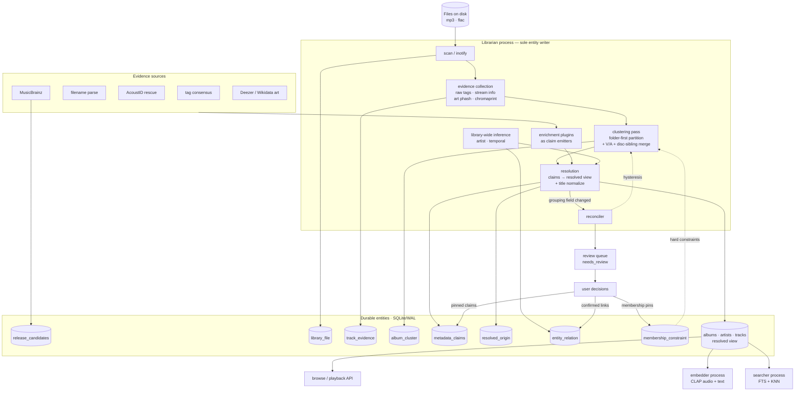

# Enrichment & album-grouping redesign — design proposal

Status: **proposal / brainstorm** — no code yet.
Scope: `kalinka-plugin-localfiles` (indexer, enricher, browse layer), with minor
server-side UI implications in the review-workflow section.

All file references are to
`packages/kalinka-plugin-localfiles/src/kalinka_plugin_localfiles/`.
Empirical numbers come from the 2026-06-16 assessment of a real tester library
(1608 artists · 696 albums · 7991 tracks — `tmp/enrichment_assess/`).

---

## 1. Diagnosis: why the current pipeline splits coherent albums

### 1.1 Album identity is an eager, brittle hash

An album *is* its ID, and the ID is computed per-track at index time:

```
album_id = md5( album_folder(file_path) + "\0" + normalize_for_id(album_tag) )
```

(`utils/id_generator.py:31-48`, called from `indexer/indexer.py:469-471`.)

Grouping is therefore a **pure function of two fragile inputs** evaluated
independently for every file, with no group-level view:

- **Any variance in the album tag inside one folder mints a new album.**
  "Everybody Hertz" vs "Air - Everybody Hertz" → two albums. The tester DB has
  45 folders split this way; the worst (`/music/Air`) fractured into 14
  "albums", several of which are single-track shards named after stray tags
  (`MTV Hits '99`, `Playground Love`) or even a filename
  (`Le solei est prs de moi.mp3`).
- **A missing album tag doesn't fall back to the folder** — it falls into the
  single library-wide `unknown_album` sentinel (`id_generator.py:41-44`). A
  fully untagged vinyl rip in a clean `Some Album/` folder produces *no* album
  at all, pooled with every other untagged track in the library.
- **The same tag in two folders → two albums** (the folder half of the key).
  This is deliberate (16-bit vs 24-bit sibling rips), but it also means
  `Album/CD1`-style layouts survive only because of one regex
  (`_DISC_SUBDIR_RE`, `utils/name_utils.py:38`); `Friends Of The Random
  Summer CD1/CD2/CD3` as *tag suffixes* (not subdirs) → 3 albums.

### 1.2 The pipeline decides once, then mutates blindly

The conceptual flow is `scan → tag-read → per-entity enrichment → done`, and
each stage commits irreversibly:

- The indexer's `INSERT OR REPLACE` (`indexer/indexer_db.py:155`) rewrites the
  whole track row on any mtime change, discarding enricher-written fields
  (mbid, embeddings, mood) and re-deriving grouping from scratch. Raw tags are
  **not persisted** — only the cleaned display strings survive, and
  `albumartist`/TPE2 and the compilation flag are never read at all
  (`indexer.py:549-667`).
- `albums.artist_id` is **first-writer-wins**: whichever track happens to be
  processed first anchors the album's artist (`indexer.py:479`), and later
  tracks never correct it.
- AcoustID enrichment can silently *move a single track to a different (or
  brand-new) album row* (`acoustid_plugin.py:718`, `_create_or_get_album`
  `:518-566`) based on one fingerprint match, with no view of the 11 sibling
  tracks that stayed behind — exactly the "uncertain external metadata
  fragments a coherent local album" failure. It also unconditionally
  overwrites the track title (`acoustid_plugin.py:680`).
- Enrichment success is defined by **required fields**, not by confidence:
  a track without an `mbid` ends `FAILED` even if its metadata is complete
  (`enricher.py:32-41`), and `FAILED` is terminal until the enrichment
  fingerprint changes. There is no notion of "locally coherent album with no
  external identity" — that state is unrepresentable.

### 1.3 Nothing records uncertainty, so nothing can be reconsidered

The schema has `match_score`/`match_similarity` (with per-source,
incomparable semantics — MB ext:score vs AcoustID confidence×100 vs an
in-release composite that can exceed 100) and a 3-state `enriched` flag.
There is no per-field provenance, no record of conflicting candidate values,
no grouping confidence, and no user-correction store (the only user lever is
a full purge-and-rescan, `module_setup.py:158-167`). Once a wrong decision is
written, the evidence that could have contradicted it is gone.

### 1.4 What already works and must be preserved

The system is not naive; three pieces are genuinely good and should survive
the redesign as *rules inside a better framework*:

- The **V/A folder coalesce pass** (`indexer.py:703-856`): folder-level
  reasoning with thresholds (≥4 distinct artists, ≥0.5 uniqueness), a
  generic-dump denylist, parent-artist remix anchoring. This is exactly the
  shape of reasoning the whole pipeline needs — it's just bolted on for one
  special case.
- **Album-before-track enrichment coupling**: MB matches the album release
  first, then constrains track lookup to that release's tracklist
  (`musicbrainz_plugin.py:568-649`), and AcoustID gives +1000 to recordings
  on the local album's release. This *is* album-level external matching; it
  just lacks a way to say "no release fits, keep the local grouping".
- **Ambiguity margins** ("holding as orphan rather than committing",
  `musicbrainz_plugin.py:471-482`): the codebase already prefers abstaining
  to guessing. The redesign generalizes that stance to grouping itself.

---

## 2. Alternative clustering architectures

Five candidates, evaluated against: no labeled training data exists; libraries
run 10³–10⁵ tracks on modest hardware; results must be stable across rescans;
the user must be able to understand *why* a grouping happened.

### A. Layered deterministic rules with confidence (folder-first)

Invert the current precedence: **the folder is the unit of grouping**; tags
vote on how many albums a folder contains rather than each distinct tag
minting one. A per-folder pass runs split/merge rules (track-number sequence
analysis, artwork groups, tag consensus) and emits clusters with a confidence
score and a provenance trail.

- **Pros:** deterministic, debuggable, idempotent, O(files); directly fixes
  every observed failure class (45 folder splits, untagged rips, V/A);
  generalizes the existing V/A pass instead of replacing it.
- **Cons:** hand-set thresholds; cross-folder merges need separate rules;
  confidence numbers are ordinal, not calibrated probabilities.

### B. Pairwise scoring → graph clustering (weighted edges, connected components / correlation clustering)

Score `P(same album)` for track pairs within a blocking scope, build a graph,
cut it. Correlation clustering (maximize agreement with edge signs) or simple
thresholded connected components.

- **Pros:** principled handling of conflicting evidence; negative edges
  (disjoint track sequences, different artwork) naturally force splits;
  extensible — a new signal is just a new edge term.
- **Cons:** pairwise is O(n²) per block (fine within folders, dangerous
  globally); correlation clustering is NP-hard in general (needs greedy/pivot
  approximations); connected components are fragile — one spurious strong
  edge merges two albums transitively; results can be unstable under small
  score perturbations, which is poison for rescan stability.

### C. Learned pairwise classifier (logistic regression / GBT) + constrained clustering

Same graph as B, but edge weights come from a trained model over the signal
vector; user corrections become labels over time.

- **Pros:** weights calibrated from data instead of intuition; logistic
  regression stays inspectable.
- **Cons:** **there is no training data today** and won't be until a
  correction UI ships and accumulates months of labels; a model trained on
  one user's library overfits their tagging habits; adds a model artifact to
  ship/version for marginal gain — the within-folder decision space is small
  enough that rules cover it.

### D. Probabilistic graphical model / full entity-resolution framework

Joint inference over track→cluster and cluster→release assignments
(e.g. a factor graph, Dedupe-style fellegi-sunter EM).

- **Pros:** the theoretically "right" formulation; uncertainty is native.
- **Cons:** massive complexity for a self-hosted music server; inference cost
  and non-determinism; near-impossible to debug ("why did my album split?" →
  "the posterior moved"); rejected outright.

### E. Density clustering on audio embeddings (DBSCAN/HDBSCAN over CLAP)

Rejected for membership decisions. This project has **measured** that CLAP
distances are not a usable relevance signal even for search ranking; albums
routinely span acoustic styles (intros, interludes, a ballad on a metal
record) while two albums by one artist are acoustically closer than tracks
within a compilation. Embeddings stay in search, out of grouping (see §8).

### Verdict

**A, essentially alone.** Folders are already natural clusters; the job is
not to build clusters from track pairs but to decide, per folder, whether
convincing evidence forces a split — and >95 % of folders never present any.
B survives only as a vocabulary: the *signal table* (§5.2) defines what
counts as evidence and how strongly, and in the rare ambiguous folder those
signals are summed per candidate partition as a tiebreak. No graph is built,
no correlation clustering or connected components run — that formalism is
heavier than the problem, and its instability under small perturbations is
exactly what rescan stability cannot afford. C is a later calibration layer
over the same signals if/when user-correction labels accumulate — the
architecture should make swapping hand weights for learned weights a config
change, not a rewrite. D and E are rejected.

---

## 3. Recommended architecture

```
                       files on disk
                            │ scan / inotify
                            ▼
        ┌──────────────────────────────────────────┐
        │ EVIDENCE COLLECTION (indexer, extended)   │
        │  raw tags (incl. albumartist, compilation,│
        │  all values verbatim) · stream info ·      │
        │  artwork hash · cue sheets · mtimes        │
        │  → track_evidence rows (current snapshot,  │
        │    upserted in place, never dropped)       │
        └────────────────┬─────────────────────────┘
                         ▼  per dirty folder
        ┌──────────────────────────────────────────┐
        │ CLUSTERING PASS (new, deterministic)      │
        │  folder = block → partition rules →       │
        │  album clusters + confidence + provenance │
        │  cross-folder merge rules (disc suffixes, │
        │  cue/sibling patterns)                    │
        └────────────────┬─────────────────────────┘
                         ▼
        ┌──────────────────────────────────────────┐
        │ METADATA RESOLUTION                       │
        │  claims (tag consensus, folder name,      │
        │  external, user) → resolved fields on     │
        │  albums/tracks (browse tables unchanged)  │
        └────────────────┬─────────────────────────┘
                         ▼
        ┌──────────────────────────────────────────┐
        │ ENRICHMENT (existing plugins, retargeted) │
        │  album-level external match → release     │
        │  candidates (claims, not overwrites)      │
        │  track-level within matched release       │
        │  AcoustID = last-resort track id only     │
        └────────────────┬─────────────────────────┘
                         ▼
          reconciler re-runs RESOLUTION (and, with
          hysteresis, CLUSTERING) for affected folders;
          low-confidence cases → review queue
```

Principles:

1. **Local grouping is primary.** A cluster exists because the files
   physically cohere; external identity is an *annotation* on it, never its
   source of existence. A cluster with zero release candidates is a fully
   valid, "enriched" album.
2. **Splitting requires positive evidence; tag variance alone is never
   enough.** The default for one folder is one album.
3. **Evidence is durable; decisions are derived and re-derivable.**
   `track_evidence` is a *current snapshot* per file, updated in place — a
   changed tag supersedes the old observation (no versioned history; the
   resolver only ever reasons over what is currently true on disk). What is
   never destroyed is the row itself and everything derived from it:
   rescan re-reads evidence, not conclusions.
4. **Membership changes only in the clustering pass** (with hysteresis), never
   as a side effect of an enrichment plugin.
5. **User corrections are pinned claims** — the top tier (§7) that resolution
   can never override and rescans never destroy.
6. **Entity-centric, pipeline-scheduled.** The durable model is a set of
   *entities* — track, album cluster, artist, recording, release candidate —
   each owning its raw evidence, inferred properties, external identities, and
   relationships (this is what the tables in §4 already are). The
   scan→cluster→resolve→enrich→reconcile flow is not a data model; it is the
   *scheduler* that decides which entity to (re)compute when. The ordering is
   real (artists can't be reconciled before albums are grouped; tracklists
   can't be aligned before a cluster exists) but subordinate — every plugin's
   job is "contribute evidence to an entity", never "run stage N".

### 3.1 Process topology: merge indexer + enricher, keep the ML processes

The current four-process model (indexer/enricher/searcher/embedder over
shared SQLite/WAL, `module_setup.py`) is kept for the ML half and collapsed
for the metadata half:

- **Librarian** (merged indexer + enricher, one asyncio process): scan,
  cluster, resolve, enrich — the *sole writer* of tracks/albums/artists,
  claims, clusters, and release candidates. The staged pipeline survives as
  phases inside this process, not as process boundaries.
- **Embedder** unchanged: ~600 MB CLAP model, heavy CPU, load/unload
  lifecycle — process isolation genuinely pays here.
- **Searcher** unchanged: serves live queries, read-mostly, owns its
  vec/FTS domain.

Rationale: the enricher is a serial, rate-limited I/O loop (1 req/s MB,
`limit=1` fetches) that needs neither a core nor memory isolation, while the
redesign's scan→cluster→resolve→enrich→re-cluster loop is one state machine
per folder. Split across two processes it requires either two copies of the
reconciler rule engine (guaranteed drift — exactly the existing V/A
duplication between `orphan_va_folder_tracks` and the fallback plugin's
`_track_is_in_va_folder`) or a queue-RPC dance with folder locking. A single
writer makes the core invariant — membership changes only in the clustering
pass — enforceable by construction, and erases the current check-then-insert
race class between indexer and enricher (no cross-process transactions
exist). Merge prerequisites: move the sync `musicbrainzngs` calls to
`asyncio.to_thread` so a slow lookup can't stall scanning (`fpcalc` is
already a subprocess); keep the enrichment-fingerprint retry and one-shot
config machinery as-is. Cost accepted: enricher crash isolation (already
optional in the health rollup); gained: one fewer interpreter on Pi-class
hosts and one fewer nudge-queue hop (indexer→enricher becomes an in-process
call; the searcher nudge remains).

To be precise about what is load-bearing here: the *requirement* is the
**single-writer invariant** — exactly one process mutates entities. The
merge is the cheapest implementation of it for this codebase; the
alternative (scanner/provider workers sending evidence messages to a
sole-writer librarian) preserves more crash isolation at the cost of a
message protocol and is the documented fallback if the merge proves painful
in practice. What is *not* acceptable is the status quo of two peer writers.

### 3.2 Architecture at a glance

The whole target system: evidence in, a single-writer librarian that clusters
→ resolves → enriches → reconciles, durable entities beside the resolved
browse view, and the two ML processes reading that view. Evidence sources and
the review loop feed claims; nothing but the librarian writes entities.



Reading it: the **librarian** is the only box that writes the entity tables;
**evidence sources** (local + external) contribute *claims*, never direct
writes; **resolution** materializes the `albums/artists/tracks` view the rest
of the app already consumes; the **reconciler** re-runs clustering under
hysteresis when a grouping-relevant field changes; and **user decisions** from
the review queue land as pinned claims / membership constraints / confirmed
relations that the pipeline treats as hard, durable evidence. The embedder and
searcher stay separate processes reading the resolved view.

---

## 4. Data model

Design constraint: the browse layer (`localfiles.py`, `input_module_db.py`)
and the server API consume `albums`/`artists`/`tracks` as they are. Keep those
tables as the **resolved view**; add evidence/claims tables beside them. An
album row *is* the materialization of a local album cluster.

```sql
-- Stable file identity, independent of path. THE fix for the path-derived
-- track_id problem: identity is minted once; a rename/move updates
-- current_path and nothing else. Move detection on rescan uses, in order:
-- inotify file_moved events, (device_id, inode), content_hash/fingerprint
-- corroboration, then size+mtime as weak evidence — falling back to
-- new-file only when nothing matches. tracks.id becomes this file_id
-- (old path-hash ids migrate once via entity_id_alias).
CREATE TABLE library_file (
    file_id        TEXT PRIMARY KEY,          -- opaque, minted once
    current_path   TEXT NOT NULL UNIQUE,
    size_bytes     INTEGER NOT NULL,
    modified_at    INTEGER,
    device_id      TEXT,                      -- st_dev; helps move detection
    inode          TEXT,                      -- st_ino; not sole identity
                                              -- (NAS/FUSE lie), corroborating
    content_hash   TEXT,                      -- lazy; computed on demand
    first_indexed  INTEGER NOT NULL           -- never rewritten
);

-- Verbatim per-file evidence. CURRENT SNAPSHOT semantics: upserted in place
-- when the file changes (old observations are superseded, not versioned);
-- the row survives rescans and is dropped only when the file is gone.
CREATE TABLE track_evidence (
    track_id       TEXT PRIMARY KEY,          -- = library_file.file_id = tracks.id
    raw_tags       TEXT NOT NULL,             -- JSON: every tag verbatim, incl.
                                              -- albumartist, compilation, date,
                                              -- disc/track totals, sort names
    stream_info    TEXT NOT NULL,             -- JSON: sample_rate, bit_depth,
                                              -- channels, codec, encoder string
    art_phash      TEXT,                      -- perceptual hash of embedded art
    cue_sheet      TEXT,                      -- path of owning .cue, if any
    fingerprint    TEXT,                      -- chromaprint, once computed
    fp_computed_at INTEGER,
    fs_created     INTEGER,                   -- (path/size/mtime/first_indexed
                                              -- live on library_file)
    import_batch   TEXT                       -- scan-session id
);

-- One row per local album cluster ≙ one albums row (albums.id = cluster id).
-- Cluster↔folder is many-to-many (one folder can hold two albums; one
-- multi-disc album can span sibling folders), so the folders a cluster
-- occupies are DERIVED from member tracks' paths, not stored here;
-- primary_folder is display/blocking convenience only.
CREATE TABLE album_cluster (
    album_id        TEXT PRIMARY KEY REFERENCES albums(id),
    primary_folder  TEXT NOT NULL,            -- dominant folder (most members)
    grouping_conf   REAL NOT NULL,            -- 0..1
    grouping_basis  TEXT NOT NULL,            -- JSON provenance: which rules
                                              -- fired, scores, outliers
    kind            TEXT,                     -- album|compilation|multi_disc|
                                              -- singles_pool|unknown
    generation      INTEGER DEFAULT 0,        -- bumped on re-cluster (hysteresis)
    needs_review    INTEGER DEFAULT 0,
    review_reason   TEXT
);

-- Field-level claims. SPARSE, with a precise storage policy: ALWAYS stored
-- are (a) winning non-local claims (external/inference values can expire or
-- be rejected, so their full claim must be invalidatable), (b) all pinned
-- claims, (c) all conflicts. NOT stored: uncontested purely-local values —
-- those resolve straight into the entity row and are re-derivable from
-- track_evidence; resolved_origin (below) still records their provenance.
CREATE TABLE metadata_claims (
    entity_type TEXT NOT NULL,                -- album|track|artist
    entity_id   TEXT NOT NULL,
    field       TEXT NOT NULL,                -- album_title, year, artist, ...
    value       TEXT NOT NULL,
    source      TEXT NOT NULL,                -- tag_consensus|folder_name|
                                              -- library_inference|
                                              -- musicbrainz:<mbid>|acoustid|
                                              -- deezer|filesystem|user
    tier        TEXT NOT NULL,                -- pinned|verified|observed|
                                              -- inferred|guessed (see §7)
    created_at  INTEGER,
    PRIMARY KEY (entity_type, entity_id, field, source)
);

-- External identity candidates for a cluster (0..n, ranked, never exclusive).
CREATE TABLE release_candidates (
    album_id     TEXT NOT NULL REFERENCES albums(id),
    provider     TEXT NOT NULL,               -- musicbrainz|qobuz|deezer
    release_id   TEXT NOT NULL,               -- release mbid / catalogue id
    rg_id        TEXT,                        -- release-group mbid
    score        REAL NOT NULL,
    coverage     REAL NOT NULL,               -- fraction of member tracks the
                                              -- release explains
    track_map    TEXT,                        -- JSON: track_id → (disc,pos,rec_mbid)
    status       TEXT DEFAULT 'candidate',    -- candidate|accepted|rejected
    fetched_at   INTEGER,
    PRIMARY KEY (album_id, provider, release_id)
);

-- Per-track recording identity (from AcoustID / MB), separate from grouping.
CREATE TABLE recording_identity (
    track_id  TEXT NOT NULL,
    provider  TEXT NOT NULL,
    rec_id    TEXT NOT NULL,
    score     REAL NOT NULL,
    PRIMARY KEY (track_id, provider, rec_id)
);

-- Provenance for EVERY resolved field, including uncontested ones — this is
-- what keeps sparse claims compatible with re-derivability: claims record
-- only conflicts, but the winner's origin is always known, so the resolver
-- can tell whether a value must be recomputed when its source's evidence
-- changes or a provider is disabled. evidence_ref points at the specific
-- backing object (a release_candidates key, a track_evidence field) so an
-- expired/rejected candidate can invalidate exactly the values it produced.
CREATE TABLE resolved_origin (
    entity_type  TEXT NOT NULL,
    entity_id    TEXT NOT NULL,
    field        TEXT NOT NULL,
    source       TEXT NOT NULL,
    tier         TEXT NOT NULL,
    evidence_ref TEXT,                        -- e.g. "release:musicbrainz:0d7f…"
    resolved_at  INTEGER,
    PRIMARY KEY (entity_type, entity_id, field)
);

-- Membership is a RELATIONSHIP, not a metadata field — user grouping
-- decisions need their own durable store, not a prose promise. The
-- reconciler treats these as hard constraints (the constrained-clustering
-- element); they survive rescans via stable file/cluster identity.
CREATE TABLE membership_constraint (
    id               TEXT PRIMARY KEY,
    kind             TEXT NOT NULL,           -- include|exclude|
                                              -- keep_together|keep_separate
    track_id         TEXT NOT NULL,
    album_id         TEXT,                    -- for include/exclude
    related_track_id TEXT,                    -- for keep_together/_separate
    created_at       INTEGER NOT NULL
);

-- Semantic links between entities — the propagation channels §6.5 depends
-- on. Distinct from entity_id_alias (which only redirects replaced local
-- ids): a relation asserts a fact ABOUT two live entities.
CREATE TABLE entity_relation (
    source_type TEXT NOT NULL,
    source_id   TEXT NOT NULL,
    relation    TEXT NOT NULL,                -- same_identity|
                                              -- possible_same_identity|
                                              -- variant_of|release_group_member|
                                              -- related_artist|
                                              -- duplicate_recording|
                                              -- alternate_master
    target_type TEXT NOT NULL,
    target_id   TEXT NOT NULL,
    status      TEXT NOT NULL,                -- candidate|verified|rejected|pinned
    source      TEXT NOT NULL,                -- what asserted it
    created_at  INTEGER NOT NULL,
    PRIMARY KEY (source_type, source_id, relation, target_type, target_id)
);

-- Old ids live on as aliases after splits/merges/id-migration, so artwork
-- caches, playlists, and client bookmarks keep resolving. Chains are
-- FLATTENED on write (merge of B into C rewrites A→B to A→C): resolution
-- is always a single hop, never recursive.
CREATE TABLE entity_id_alias (
    old_id      TEXT PRIMARY KEY,
    current_id  TEXT NOT NULL,
    entity_type TEXT NOT NULL
);
```

Changes to existing tables are minimal: `tracks`'s `album_id` now points at a
cluster-backed album row; `albums.match_score/similarity` are superseded by
`release_candidates.score` but kept for compatibility during migration. The
destructive `INSERT OR REPLACE` on rescan is replaced by
UPDATE-of-changed-columns so resolved/enriched fields survive
(`indexer_db.py:155`).

**Origin / era / language columns — one field, one meaning.** The field
semantics of §6.5 (inference must never launder one field into another) only
hold if the schema keeps the concepts in *separate* columns. Most exist; a
few are added so "Italian 80s" can resolve on
`artist_origin_country` + `original_release_year` without a release country
or a lyric language leaking in:

| concept | column | status |
|---|---|---|
| artist origin country | `artists.country` | ✅ exists |
| artist area | `artists.area` | ✅ exists |
| release / catalogue year | `albums.year` | ✅ exists (pin meaning to *release* year) |
| original release year | `albums.original_year` | ✅ exists |
| release language | `albums.language` | ✅ exists |
| **release country** | `albums.country` | ➕ add |
| **recording year** (track can predate the release) | `tracks.recording_year` | ➕ add |
| **track language** (a track can differ from the release) | `tracks.language` | ➕ add |

The added columns are nullable, best-effort, and never in `*_REQUIRED_FIELDS`
(a missing value never fails enrichment) — matching how `country`/`area`/
`original_year` were already introduced (`db_schema.py:317-336`). They are
populated as resolved values from claims like anything else (external match,
tag, or `library_inference`), so the raw tags in `track_evidence` remain the
source and each resolved value carries a `resolved_origin`.

**Stable cluster IDs.** The current title-dependent hash means resolving a
better title would change the album's identity — unacceptable (playlists
reference album context, artwork files are keyed by id). New scheme: the
cluster id is **minted once and persisted** (an opaque random id; nothing
derivable from mutable metadata), with explicit lifecycle semantics:

- *Re-cluster:* one-to-one maximum-overlap matching between old and new
  partitions (each old id assigned to at most one new cluster, deterministic
  tie-breaking) — never the same old id to two new partitions.
- *Split:* the child with the largest member overlap keeps the original id;
  the others get fresh ids.
- *Merge:* the dominant (largest, then oldest) cluster's id survives;
  absorbed ids become rows in `entity_id_alias` so old references keep
  resolving.
- Title changes never touch identity.

*Track identity:* solved the same way, not by migration heuristics.
`track_id` is currently path-derived (`id_generator.py:51-53`), so a folder
rename destroys track identity — and with it membership-overlap evidence
and any pins. Rather than patching that with move-detection bolted onto a
path hash, `library_file` makes file identity first-class: `tracks.id`
becomes the once-minted `file_id`, `current_path` is just a mutable
attribute, and a rename is an UPDATE. Move detection (inotify events,
device/inode, content-hash/fingerprint corroboration, size+mtime as weak
evidence) only decides *whether* an appearing path is an existing file —
no single method is trusted alone, and a miss degrades to new-file, never
to corrupted identity. Old path-hash ids migrate once through
`entity_id_alias`. Pins that die on a folder rename would poison user
trust in the whole review workflow; this closes that hole structurally.

**Claims example** (the shape requested in the brief):

```json
{ "entity": "album_3f2a...", "field": "album_title", "claims": [
    {"value": "Everybody Hertz", "source": "tag_consensus",  "tier": "observed"},
    {"value": "Air",             "source": "folder_name",    "tier": "inferred"},
    {"value": "Everybody Hertz", "source": "musicbrainz:0d7f…", "tier": "inferred"}
]}
```

Resolution writes `albums.title = "Everybody Hertz"` (observed tag
consensus beats both inferred claims; the fuzzy MB match agreeing with it
is corroboration, not the winner) and records the winner in
`resolved_origin`; the losing claims remain queryable as the conflict
record. Had all sources agreed locally with no external claim, no claim
rows would exist at all (storage policy above) — only the `resolved_origin`
row.

---

## 5. Clustering: blocking, pairwise signals, album-level rules

### 5.1 Blocking — who is ever compared with whom

Whole-library pairwise comparison is banned. Candidate scopes, in order:

1. **Folder** (primary block; after disc-subdir collapse). Covers ~all of the
   observed failures. Within-folder n is typically 8–30; worst realistic case
   a few hundred (the `/music` dump) — and since reasoning is per candidate
   subgroup (tag buckets, sequence runs, art groups), not per track pair,
   even that case stays cheap.
2. **Sibling folders under one parent**, compared *cluster-to-cluster* (not
   track-to-track): merge candidates when normalized titles differ only by a
   disc/volume suffix, or a cue sheet spans them, or tag consensus titles
   match exactly.
3. **Same normalized (albumartist, album-title) bucket across the library** —
   only to *flag* possible duplicates/variants for the review queue, never to
   auto-merge (the folder half of identity intentionally separates quality
   variants).

Complexity: O(tracks) for subgroup formation (each track is bucketed once by
tag/art/sequence) plus a handful of subgroup-pair comparisons in the rare
ambiguous folder — a bounded quadratic fallback that almost never triggers,
not the default cost. For 100k tracks / ~10k folders a full pass is
effectively one linear sweep, and the pass is incremental (dirty folders
only) after the first run.

### 5.2 Membership signals

The evidence vocabulary for "do these belong to the same local album". These
signals are **not** evaluated for every track pair: the folder pass first
forms candidate subgroups (tag buckets, track-number sequence runs, art
groups — §5.3), and only when a split is *plausible* are the signals summed
**between the candidate subgroups** as a tiebreak. A 12-track folder with one
tag consensus and one art group evaluates nothing at all. Hand-set integer
weights, stored in one table in code, logged per decision (the
`grouping_basis` JSON).

Positive:

| signal | weight | notes |
|---|---|---|
| same folder | +4 | the prior; this is why folder is the block |
| same cue sheet | +6 | near-decisive |
| identical/near art phash | +3 | hamming ≤ threshold on embedded art |
| compatible track numbers (no collision, plausible joint sequence) | +2 | |
| same normalized album tag | +2 | supporting, **not** required |
| same albumartist tag / compilation flag agreement | +2 | newly read |
| same codec + sample rate + bit depth + encoder string | +1 | one rip session |
| fs timestamps within one write session | +1 | rip batches |
| same import batch | +1 | |

Negative:

| signal | weight | notes |
|---|---|---|
| track-number collision (both claim #4) with different titles | −3 | strongest split evidence when systematic |
| disjoint disc numbers with own 1..n sequences *and* differing tags | −2 | multi-disc handled at album level first |
| clearly different art phash groups | −3 | |
| different albumartist (both explicit, both non-V/A) | −2 | |
| different album tags **and** both tags each cover a complete plausible sequence | −3 | the "two albums in one folder" case |
| gross stream mismatch (44.1/16 vs 96/24) aligned with a tag split | −1 | tie-breaker only — deluxe editions legitimately mix |

Deliberately excluded: CLAP/audio-embedding distance (measured unreliable,
§8); title string similarity between *track* titles (irrelevant to
membership); year alone (remaster tags lie).

**Hand weights vs learned model:** hand weights, for now. The decision space
is small, the signals are few and interpretable, there is zero labeled data,
and every mis-weighting shows up as an explainable rule firing in
`grouping_basis`. The signal vector is exactly what a logistic regression
would consume, so when the review UI has produced a few thousand
accept/split/merge labels, fitting weights (per-signal coefficients, same
structure) is a drop-in replacement — schedule that as the *last* phase, not
the first.

### 5.3 Album-level rules (the actual split/merge decisions)

The group decisions are rule-shaped and ordered; §5.2's signal sum breaks
ties between candidate partitions when a rule fires ambiguously:

**One folder stays one album unless** at least one of:

- **Duplicate-sequence rule:** members partition into ≥2 subsets that *each*
  form a plausible 1..n track sequence (≥60 % of a contiguous range, ≥4
  tracks), and the subsets are separated by at least one strong negative
  signal (distinct tag consensus, distinct art groups, disc-number
  partition). → split. Covers "24 tracks = Album A + Album A (remaster)".
- **Multi-signal identity rule (no sequences needed):** members partition
  into ≥2 substantial subgroups (each ≥ max(3, 25 % of folder)) that differ
  on **at least two independent** strong identity signals — coherent album
  tag, art group, explicit albumartist — even when track numbers are absent
  or unusable. Covers two untagged-number albums dumped in one folder. One
  differing signal alone (tags only) is never sufficient — that is the
  original over-splitting bug.
- **V/A dissolution rule:** the existing thresholds (≥4 distinct artists,
  uniqueness ≥0.5, generic-dump denylist) — kept as-is, now emitting a
  `kind='compilation'` or `kind='singles_pool'` cluster with provenance
  instead of ad-hoc repointing.
- **User pin.**

**Outlier absorption (never split for these):** a minority tag subset that
does *not* form its own sequence — e.g. 12 tracks: 9 × "Album X", 2 × empty,
1 × "Album Y" where the Album-Y track holds track #7 of the X sequence — stays
in the cluster; the deviant tags become losing claims and a per-track
`conflict` record ("embedded album tag likely wrong"). Threshold: subset
< max(2, 25 % of folder) *and* no independent sequence *and* no distinct art.

**Merge rules (cross-folder / cross-cluster):**

- disc-suffix siblings: normalized titles equal after stripping
  `(CD|Disc|Vol)\s*\d+`, disc numbers/sequences complementary, **and**
  album-artist evidence compatible (or artwork matches, or a cue sheet
  spans them) → merge into one `multi_disc` cluster (fixes the Mum
  CD1/CD2/CD3 split). Title + complementary sequences alone is not enough —
  `Greatest Hits CD1`/`CD2` by two different artists must not fuse.
- cue sheet spanning folders → merge.
- a folder's tracks tag-match a sibling cluster's consensus exactly and track
  ranges are complementary (a "bonus disc" folder) → merge proposal to the
  review queue (auto-merge only when art also matches).

**Title resolution for the cluster** (claims, §4): tag consensus (weighted by
share of members) > folder name (cleaned) > external candidate title. An
untagged folder rip thus gets its folder name as the album title with modest
confidence — today it gets `unknown_album`.

**Title normalization** (a claim transform applied before resolution, needed
whichever source wins): folder- and tag-derived titles leak junk that must be
stripped for a clean display value — measured on a real 526-track library,
title quality (not grouping) was the dominant remaining defect. The
normalizer removes, in order that preserves the real name:

- a trailing disc/volume marker *only when the cluster is genuinely multi-disc*
  (members' titles differ only by that suffix) — a standalone `… Vol. 2` keeps
  its name (already shipped in Phase 1's planner);
- a leading `YYYY.` / `YYYY -` year prefix (`1993. Jean Michel Jarre - …`);
- a trailing catalog/pressing parenthetical (`(Sony 88875129492, Russia)`,
  `(EG, EGHP 50, UK, 24-192)`);
- format / quality tokens (`MP3`, `FLAC`, `WEB`, `24-192`, `Hi-Res`);
- a leading artist prefix via `strip_artist_prefix` — **only when the
  remainder is a substantive title**. Measured on the tester DB, blind
  stripping degenerates: "Crystal Castles (II)" -> "(II)", "Mogwai EP" ->
  "EP". The guard: keep the original unless the remainder has a real word
  beyond a bare parenthetical / edition token ("EP", "(Limited Edition)");
- stray bracket tags (`{uaoa}…`).

Each rule is deterministic and reversible-in-review; the raw tag/folder value
stays in the claim so a normalization mistake is auditable and undoable. The
`assess-enrichment` skill's `path_artifact_titles` detector is the evaluation
signal — it should trend to ~0 as the normalizer lands. This is **not** a new
title *source*, only a cleanup of the winning claim, so it never invents a
title, and it never overrides an external (verified) release title that is
already clean.

**Album artist resolution:** albumartist tag consensus > single common track
artist > V/A sentinel (compilation rule) > parent-folder artist (remix rule,
kept from `_parent_artist_for_folder`). First-writer-wins dies.

---

## 6. Enrichment redesign

### 6.1 From linear per-entity passes to evidence rounds

The plugin chain (`enricher.py:70-108`) survives, but plugins stop writing
entity fields directly; they emit **claims** and **candidates**. The
per-entity `limit=1` loop becomes a per-*cluster* work queue:

```
for each cluster needing enrichment:
    1. resolve local claims first (tag consensus, folder, filesystem parse)
    2. album-level external match (MB release search: artist+title,
       track count, duration sum, tracklist alignment)  → release_candidates
    3. per-track pass constrained to the accepted candidate's tracklist
       (existing _lookup_track_in_release, musicbrainz_plugin.py:568-649)
    4. AcoustID only as a last-resort identifier for tracks whose artist
       or title is still completely unknown after all local sources
       (tags, filename parse, folder context) → title/artist/recording-id
       claims for that track and nothing else
    5. resolution pass; if a claim changes a grouping-relevant field,
       mark folder dirty for the reconciler
```

`FilesystemFallbackPlugin` is gone: its parsing moved into step 1, where the
indexer reads the path whenever the tags leave a gap and records what it
found as a `guessed` claim from `filename`/`folder_name`. Its conservative
"only fill unknowns" write guards became exactly that provenance. Album
titles stayed with the clustering pass, which sees a whole folder at once;
the parse contributes one rung to its title ladder. Deezer/Wikidata/
procedural artwork remain cover/image providers, unchanged in spirit —
except that the generator now draws after resolution rather than inside the
fetch chain, so it never keys art to a title about to be corrected.

**"Enriched" is redefined.** A cluster is *done* when local resolution is
complete and external matching has been attempted — a bootleg with zero
external identity is `ENRICHED (local-only)`, not `FAILED`. The required-field
lists (`enricher.py:32-41`) shrink to genuinely required local fields; `mbid`
and `image_url` move from "required" to "desired". This deletes failure mode
"correct MB match without a cover ⇒ FAILED forever".

### 6.2 Album-level external matching

Track-level lookup remains, but the primary MB interaction becomes: search
releases by resolved artist + title; score candidates by the existing stage
A/B machinery (`ext:score`, string similarity, `track_count_bonus`,
`album_duration_bonus`) **plus tracklist alignment** — a **monotonic
sequence alignment** (Needleman-Wunsch-style dynamic programming, n ≤ 30) of
the local track order against the release track order, with
title-similarity + duration costs, gap penalties for missing/bonus tracks,
and reduced penalties at disc boundaries. Order-preserving alignment, not
optimal assignment: Hungarian matching would happily map local track 9 to
release position 2 on a title coincidence, which sequence monotonicity
forbids; albums have an inherent order and absent tracks should behave like
gaps, not free permutations. Store the top ≤3 as `release_candidates` with
`coverage` = fraction of members explained.

Decision policy:

- coverage ≥ 0.9, score above threshold, margin ok → `accepted`; resolved
  metadata (original year, genre, disc/track numbers via `track_map`) flows
  in as *inferred*-tier claims under the §7 field policy — a fuzzy
  acceptance fills gaps and attaches canonical identity but never displaces
  locally observed title/artist; only a direct identifier or user
  confirmation upgrades it to *verified*. Unmatched members **stay in the
  cluster** flagged `bonus/unmatched` — a partial match never ejects tracks.
- 0.5 ≤ coverage < 0.9 → keep as `candidate`, surface in review if the
  cluster is otherwise confident ("external release explains 9 of 12
  tracks").
- Two candidates within the ambiguity margin but same release group →
  accept the release group, leave edition unresolved (extends the existing
  `_same_release_group` carve-out, `musicbrainz_plugin.py:471-482`).
- Conflicting release groups → hold, record both, review-queue only if the
  user has that view open; local grouping is unaffected either way.

**When to skip external lookup entirely:** cluster kind `singles_pool`;
clusters whose resolved title matched the generic-dump denylist; clusters the
user pinned as local-only; re-lookups gated by a negative-result cache with
TTL (weeks) plus the existing fingerprint-versioning for logic changes.
This cuts MB traffic markedly — today every track fires a global
`search_recordings` fallback even when the album context already failed.

### 6.3 AcoustID narrowed to identity rescue

AcoustID's only job is answering "what track is this?" when local evidence
cannot. **Rescue mode** is defined as: no external source identified the
track, **or** its artist or title is absent or supplied by nothing but the
path. The second clause is what survives moving AcoustID behind the text
sources: MusicBrainz searches with the name it was given, so when that name
is a filename guess, a match on it proves nothing the audio cannot overturn.
The archetype is a generically named file (`track01.mp3`, `AUD_0043.mp3`) in
a dump folder, but a tagged-yet-titleless file whose filename parse yields
nothing also qualifies. For
those tracks it emits title/artist claims and a `recording_identity` row —
and that is all. It is **not** an album-detection signal: it does not vote
on release candidates, does not contribute to clustering, and its current
powers to create albums, move tracks, and unconditionally overwrite titles
(`acoustid_plugin.py:680`, `:695-718`) are removed. A track an external
source identified *and* a tag named is never fingerprint-looked-up; a
missing album never triggers a lookup either way, because album identity is
the cluster's job.

Two operations the current plugin conflates are kept separate: **local
chromaprint generation** (fpcalc, no network) and **remote AcoustID
lookup**. Rescue mode gates the *lookup*. Chromaprint generation is
independently useful — duplicate detection, move-tracking (§4), linking
local recordings to accepted releases — and may run as an opt-in background
backfill on any track without triggering a single web request. Fingerprints,
once computed, are persisted in `track_evidence` (today they're recomputed
per attempt — wasteful at 30 s `fpcalc` timeouts).

### 6.4 Oscillation prevention

Membership oscillation is structurally impossible in steady state because
enrichment cannot move tracks. The remaining loop —
claims → reconciler → re-cluster → new claims — is damped by:

1. **Hysteresis:** re-clustering a folder only *applies* a new partition if
   its group score beats the incumbent's by a fixed margin (say 15 %);
   ties keep the incumbent. Incumbency is explicit (`generation`,
   `grouping_basis` stores the incumbent score).
2. **Monotone claim classes:** external claims may refine resolution but
   grouping-relevant *structural* evidence (sequences, art, cue, folder) is
   local-only, so a provider flip-flop can't re-partition anything.
3. **Pinned claims** freeze both membership and fields.
4. **Generation cap:** a folder re-clustered > N times per scan cycle goes to
   the review queue instead of churning.

Reconciliation triggers: new/changed/removed files in a folder (already
detected via mtime/inotify), a user correction, an accepted release
candidate that implies disc/track renumbering, an enricher claim on a
grouping field. Provider metadata arriving for *one track* never triggers
re-clustering by itself.

### 6.5 Library-wide inference & entity reconciliation

The folder is the right scope for *grouping*, but the wrong scope for
*metadata*: the library as a whole already knows things no single folder
does, and no external lookup can beat evidence you already own. A
reconciliation pass runs after album resolution, upward through the entity
graph (tracks → albums → artists) and propagates back down, emitting claims
with source `library_inference`:

- **Artist propagation.** Origin country is *artist-entity* evidence, so
  the operation is artist-to-artist: several local artist rows are verified
  as one identity (a `same_identity` relation in `entity_relation`), some
  carry `artist_origin_country = Italy`, the others inherit it as an
  inferred claim — likewise area, sort name, and genre distribution. What
  albums contribute is the *identity evidence* (shared MBIDs, shared
  release credits), never the origin value itself. In the tester DB 21.8 %
  of artists lack an MBID while many share identity with already-enriched
  rows; this pass closes such gaps for free and gives every *future* import
  a head start.
- **Field semantics — propagate only semantically identical fields.** The
  model keeps distinct fields distinct: `artist_origin_country` ≠
  `release_country` (an Italian release can be by a British artist);
  `original_release_year` ≠ `release_year` ≠ recording year (a 2011
  remaster contains a 1982 recording — the schema's existing
  `year`/`original_year` split, now enforced in inference too);
  `track_language` ≠ artist nationality (singing in Italian doesn't make
  you Italian). A query like "Italian 80s" needs `artist_origin_country` +
  `original_release_year`, and inference must never launder one field into
  another to fake coverage.
- **Temporal inference.** Within a resolved cluster: 11 tracks tagged 1982
  and one untagged → year claim for the straggler; disc 1 dated, disc 2 not
  → propagate across the `multi_disc` cluster (same-field only, per above).
  Same pattern for genre and language at album scope. Purely local
  arithmetic, zero requests.
- **Identity guard — propagate only across *verified* identity.** Inference
  flows through an entity link, never through a name. Sufficient for
  automatic propagation: same provider ID (MBID), a user-confirmed
  identity, or a `same_identity` relation already at `verified`/`pinned`
  status in `entity_relation`. **Exact-name match
  is never sufficient on its own** — two sparse artists sharing "John
  Williams" have no conflicting evidence precisely *because* nothing is
  known about them; absence of contradiction is not identity. A bare name
  match produces an identity *candidate* (a review-queue link, same
  machinery as §6.5 dedup links), and only its confirmation — by a user, or
  by multiple independent fields subsequently agreeing with no strong
  contradiction — upgrades it to a propagation channel. When in doubt,
  abstain — the standing rule.
- **Duplicate detection as *links*, not merges.** The same
  candidate+margin pattern used for releases applies to three more entity
  pairs, each producing review cards rather than automatic merges:
  - *artists*: "Miles Davis" / "Miles Davis Quintet" — related but
    **distinct** entities; a detected relation is surfaced, never collapsed;
  - *albums*: "Kind Of Blue" / "Kind Of Blue (Remastered)" — two local
    clusters, one release group; linking them (shared `rg_id`) is exactly
    the local-vs-canonical separation, and the §5.1 cross-library bucket
    already flags these. Only trivial case-folding variants
    ("Kind of Blue") auto-normalize;
  - *recordings*: "Take Five" / "Take Five (2003 Remaster)" — linked via
    `recording_identity` when fingerprints or an accepted release prove it,
    labeled duplicate-variant for the dedupe view.
- **Scheduling.** The pass is incremental like everything else: an artist is
  re-reconciled when one of its albums resolves or a user pins a field. It
  emits ordinary claims, so provenance, pins, and the oscillation damping
  of §6.4 apply unchanged.

This also rebalances the provider hierarchy: external services become one
evidence source among several — and for most fields not the strongest one.
The effective per-field precedence (folder/tags/library above external for
titles and grouping; library-inference or external leading for
country/area/original-year) is deliberately *per-field*, not a global
ratio — a single global weighting would be wrong for half the fields.

---

## 7. Confidence and provenance model

Replace the three incomparable score families with **five ordinal tiers**,
not a pervasive 0..1 float — most fields never have competing values, and a
scale of hand-tuned decimals (0.63 vs 0.71) is precision the system cannot
back up and behavior-changing knobs nobody can verify:

| tier | meaning | sources |
|---|---|---|
| **pinned** | user said so; never overridden, never expired | user pin |
| **verified** | confirmed through a *direct identifier*, not similarity | user-confirmed link; a release MBID already present in the tags; barcode/catalog number + compatible tracklist; ISRC/recording-ID coverage; a rescue-mode AcoustID match (a chromaprint names the recording itself); cue sheet |
| **observed** | directly read from the files, taken at face value | unanimous tag consensus, folder facts (structure, disc subdirs) |
| **inferred** | derived from evidence with a real chance of being wrong | majority tag consensus, folder-name titles, library inference (§6.5), a corroborating AcoustID match on an already-named track, **fuzzy-accepted external matches** (title/duration/alignment scoring, however high the score) |
| **guessed** | last-resort fallback | filename parse, fuzzy cover-only matches |

Two boundaries here carry the weight. *Verified/observed:* unanimous tags
are **one** observation repeated n times, not n independent ones — a whole
folder tagged wrong by a single tagging session is unanimous and wrong; a
direct-identifier match may correct even unanimous tags, which a merged
"known" tier could not express. *Verified/inferred:* an external match
accepted through fuzzy scoring — title similarity, durations, tracklist
alignment, margin — is still **inference**, however high the coverage; it
can pick the wrong edition or a structurally similar release. Placing it at
inferred means a fuzzy MusicBrainz result can never silently outrank a
unanimous embedded album title (observed > inferred) merely because it
crossed an internal threshold. The accompanying field policy: a
fuzzy-accepted match may fill `original_release_year`, attach canonical
release identity, and normalize obvious formatting — it does **not**
replace the locally observed display title or artist unless the match is
upgraded to verified by a direct identifier or user confirmation.

Resolution: higher tier wins; *within* a tier, a fixed per-field source
precedence decides (e.g. for `album_title`: tag consensus > folder name >
external; for `country`: external > library inference). Numeric scores exist
only **inside** a source's own accept/reject decision (MB match scoring,
coverage thresholds, §5.2 partition tiebreaks) — they are how a claim *earns*
a tier, and they stay out of cross-source comparison entirely. A
tier-and-source change is observable and explainable; a 0.05 float delta is
neither. Stability rule: the currently-resolved value keeps winning against
an equal-tier rival (incumbency), so display never churns.

`grouping_conf` on clusters keeps its 0..1 form but with the same discipline:
it is derived from which rules fired and the margin over the best alternative
partition, serialized into `grouping_basis`, so "why is this one album?" is
answerable from the DB with no re-computation.

Calibration is Phase-5 work and gets simpler with tiers — but it is checked
per **source × field**, not per tier in aggregate: a tier is an operational
category, not a statistically homogeneous population. Embedded album titles
may hit 99 % while embedded compilation flags or years sit far lower;
`tag_consensus × album_title` and `tag_consensus × original_year` are
separate rows in the reliability report. The bar: verified/observed cells
≥ ~99 %, inferred cells ≥ ~90 %; a cell that underperforms demotes that
source *for that field* — one discrete decision instead of re-tuning a
table of decimals.

---

## 8. Audio-based evidence — what is and isn't worth it

Grounded in what the project has already measured (CLAP distance is not a
reliable relevance signal even for search):

| signal | verdict | use |
|---|---|---|
| chromaprint fingerprint identity | **yes** | exact/near-duplicate detection; recording identity; "same track appears twice in folder" → strong split/dedupe evidence. Already computed; just persist it. |
| container/stream info (sample rate, bit depth, channels, codec, encoder string) | **yes** | free from mutagen stream info; one rip session is homogeneous; cheap positive/negative signal (§5.2) |
| ReplayGain tags / loudness | **weak yes** | already read when present; album-gain agreement is mild positive evidence; do not compute loudness ourselves in v1 |
| leading/trailing silence, splice continuity across track boundaries | **defer** | genuinely indicative for vinyl/cassette side rips (track N end flows into N+1 start), but requires decoding every file; O(library) DSP on modest hardware for a signal folder-membership already covers. Revisit only if real-world folders defeat the structural rules. |
| CLAP / acoustic embeddings for membership | **no** | measured unreliable; albums are acoustically heterogeneous by design |
| vinyl surface-noise / mastering similarity, encoder forensics | **no** | research-grade, low marginal value over stream info + timestamps |
| different-master detection (same recording, different mastering) | **partial** | fingerprint match + differing stream info/duration ≈ different edition; label as duplicate-variant for review, don't auto-act |

Net: v1 uses only signals that are free at scan time plus the fingerprints
the enricher already computes. No new DSP.

**Forward marker — `track_semantic_profile`.** The rejection above is about
*grouping*, not about audio understanding generally. The pieces of a
per-track semantic profile already exist scattered across the schema (CLAP
embedding, mood valence/arousal, and formerly predicted tags); naming them
as one entity — mood, energy, instrumentation, danceability, era estimate,
computed once per track and versioned like embeddings — is where search,
recommendations, playlist generation, and duplicate detection will draw
from as lightweight audio models improve. It plugs into the entity model of
§3 as another evidence-owning entity; it is out of scope for this proposal
and deliberately kept out of every grouping decision.

---

## 9. User interaction

Two surfaces, deliberately asymmetric:

- **Normal UI:** nothing changes except correctness. At most a subtle badge
  on albums with `needs_review` (behind a setting, default off). Kalinka is a
  player, not a tag editor.
- **Library-maintenance view** (new, low-priority screen or even server web
  UI first): a review queue fed by `needs_review` clusters and unresolved
  conflicts, each item a one-decision card:
  - "These 11 tracks look like one album — confirm?" [keep / split]
  - "This folder may contain two albums" [keep one / split as proposed]
  - "Track 7's album tag disagrees with the album" [use cluster value / keep tag]
  - "MusicBrainz suggests 'X (2011 Remaster)' for this rip (explains 10/12
    tracks)" [adopt external structure / keep local grouping / reject match]
  - merge proposals for sibling folders.

Every decision writes a pinned claim (field decisions), a
`membership_constraint` row (grouping decisions), or an `entity_relation`
status change (identity/variant links) — all durable schema, §4, not
prose. Pins survive rescans (keyed to file/cluster identity, both now
stable, §4), are exported/imported with the library DB, and are excluded
from every future automated overwrite path by construction (no tier outranks
pinned; the reconciler treats pinned membership as hard constraints —
this is the "constrained clustering" element, cheap because constraints are
per-folder).

Review volume expectation from the tester library: ~45 split-folders + ~14
V/A coalesce candidates + ~9 mistag candidates ≈ 70 items for 8k tracks —
a few screens once, then a trickle.

---

## 10. Performance, incrementality, storage

- **Compute:** clustering is per-dirty-folder; a folder pass is tag
  normalization + sequence analysis + ≤ n² integer scoring, microseconds to
  milliseconds. Initial full pass over 100k tracks ≈ one library scan's cost;
  art perceptual hashes (8-byte dHash on the already-decoded embedded image)
  add negligible time at index.
- **External I/O** unchanged in mechanism (serial, rate-limited: MB 1 req/s
  via musicbrainzngs, AcoustID 3 req/s) but reduced in volume: one release
  search per cluster instead of per-track global fallbacks, negative-result
  caching, and skip rules for `singles_pool`. The sync musicbrainzngs calls
  that today block only the standalone enricher loop must move to
  `asyncio.to_thread` at the Phase-2 process merge (§3.1), since after the
  merge they would otherwise stall scanning too — this is a merge
  prerequisite, not an optional cleanup.
- **Storage** (100k tracks): `track_evidence` raw-tag JSON ~0.5–1 KB/track
  → ≤ 100 MB worst case, likely ~30 MB; fingerprints ~1–3 KB compressed
  chromaprint/track → ~200 MB *only if persisted for all tracks* — persist
  only when computed (AcoustID-eligible tracks), which today is the
  unknown-artist/album subset; claims are a handful of short rows per entity
  → tens of MB. All fine for SQLite/WAL on a Pi-class host; `vec_*` tables
  already dwarf this.
- **Rescan stability:** evidence upsert (no REPLACE), stable cluster ids with
  overlap re-attachment, hysteresis everywhere. A rescan of an unchanged
  library must be a **semantic no-op** — zero entity updates, zero
  cluster-generation bumps, zero new claims/origins/aliases, identical
  exported logical state — and that becomes an explicit test. (Not
  byte-identical SQLite files: WAL checkpointing and page layout make raw
  bytes meaningless as an invariant.)

---

## 11. Migration & staged implementation roadmap

Each phase ships independently and improves behavior on its own. **Commit
granularity: every phase is at least one self-contained commit, and the
larger phases are broken into the ordered sub-commits listed below — each a
green-tests, independently-revertable step, never one mega-commit per
phase.** The rule of thumb: a schema/migration change, a
mechanism-preserving refactor, and a behavior change are always separate
commits, so a regression bisects to a small diff and any single step can be
reverted without unwinding the rest of the phase.

1. **Phase 0 — stop destroying evidence.** Read albumartist/TPE2 +
   compilation flag + full raw tags; add `library_file` (stable file
   identity + `first_indexed`) and `track_evidence` (raw tags, stream
   info, art phash, import batch); replace track
   `INSERT OR REPLACE` with surgical UPDATE; persist chromaprints when
   computed. Preserve the original indexing timestamp: today a re-processed
   file's REPLACE rewrites `last_updated`, so a tag edit or rescan makes old
   tracks look newly added (the `recently_added` view and root "Recently
   Added" section order by it) — `first_indexed` is written once on first
   sight of the file and never touched again, and becomes both the
   recency signal for browse and the import-batch grouping evidence for
   clustering. No behavior change visible to users otherwise.
   *(Small; pure indexer + schema.)*
   Commits: (0a) `library_file` + `track_evidence` schema + migration
   (stable file identity from day one — every later phase keys off it);
   (0b) extend tag reading (albumartist/compilation/verbatim raw tags)
   writing into evidence; (0c) replace `INSERT OR REPLACE` with surgical
   UPDATE + `first_indexed` preservation; (0d) persist chromaprints + art
   phash when computed.
2. **Phase 1 — folder-first clustering.** Implement the per-folder partition
   pass (split rules, outlier absorption, V/A pass folded in as rules),
   stable cluster ids, folder-name fallback title for untagged folders.
   This alone fixes: the 45 folder splits, the Air-folder shards, untagged
   vinyl rips landing in `unknown_album`, first-writer-wins album artists.
   Migration = one re-cluster pass over existing DBs (id re-attachment by
   overlap keeps most album ids; artwork files keyed by kept ids survive).
   *(The core phase; biggest and highest-value.)*
   **The membership write guard ships in this phase, not Phase 2** — with
   folder-first clustering live, an enrichment plugin that can still
   reassign `tracks.album_id` would fragment the new clusters and violate
   the §3 invariant during the gap between phases. Structurally: one
   repository method owns `album_id` writes, callable only by the
   cluster/reconciler path; AcoustID's album-create/track-move code is
   disabled here (its full claim-emitter conversion still lands in
   Phase 2).
   Commits: (1a) `album_cluster` + `membership_constraint` schema +
   stable-id lifecycle (mint/split/merge/alias, §4) + path-hash→file_id
   migration — the constraint table ships now, internal-only, so the
   reconciler is constraint-aware from its first run and Phase 4's UI
   *reveals* an established model rather than introducing one;
   (1b) membership signal scorer (§5.2) as a pure, unit-tested function;
   (1c) folder-partition rules + outlier absorption (§5.3), behind a flag;
   (1d) fold the existing V/A pass into the rule engine; (1e) cross-folder
   disc-suffix merge; (1f) membership write guard + disable AcoustID
   membership writes; (1g) enable + one-time re-cluster migration.
3. **Phase 2 — claims & resolution.** The indexer/enricher process merge
   (§3.1) lands here, at the start of the phase — converting plugins to
   claim emitters and introducing the reconciler only makes sense with a
   single writer. `metadata_claims`, resolution pass,
   conflict records; enricher plugins converted to claim emitters; redefine
   ENRICHED/local-only; drop mbid/image from required fields. AcoustID is
   narrowed to rescue mode here (§6.3): gated to tracks whose artist or
   title is still absent after all local sources, and stripped of
   album_id/artist_id/title write powers.
   Commits: (2a) move sync musicbrainzngs calls to `asyncio.to_thread`
   (merge prerequisite, §10); (2b) merge enricher into the librarian process,
   mechanism-preserving (queues→in-process calls, no behavior change);
   (2c) `metadata_claims` + `resolved_origin` + `entity_relation` schema +
   the origin/era/language columns (§4: `albums.country`,
   `tracks.recording_year`, `tracks.language` — nullable, never required) +
   resolution pass writing the resolved view (relations ship before the
   inference that uses them, same schema-first rule as 1a);
   (2d) convert each plugin to a claim emitter (one commit per plugin);
   (2e) redefine ENRICHED/local-only + shrink required fields; (2f) narrow
   AcoustID to rescue mode + strip its title overwrite (its membership
   writes are already dead since 1f);
   (2g) library-wide inference pass (§6.5): artist propagation + temporal
   inference emitting `library_inference` claims — lands here because it is
   pure claim machinery with no external dependencies, and it recovers
   metadata *before* Phase 3 spends any MB requests on it;
   (2h) title normalizer (§5.3): deterministic cleanup of the winning
   title claim — strip year prefix, catalog/pressing parenthetical, format
   tokens and stray bracket tags from folder/tag-derived titles. Measured as
   the dominant remaining defect on a real library (11 path-artifact titles
   / 71 albums); tracked by `assess-enrichment`'s `path_artifact_titles`.
4. **Phase 3 — album-level external matching.** `release_candidates` with
   tracklist alignment + coverage; per-track lookups constrained to accepted
   candidates; skip/negative-cache policies. (Builds directly on existing
   stage-A/B and in-release code.)
   Commits: (3a) `release_candidates` schema; (3b) tracklist-alignment +
   coverage scorer; (3c) accept/hold decision policy + claim flow;
   (3d) skip rules + negative-result cache.
5. **Phase 4 — review workflow.** `needs_review` queue endpoint, pinned
   claims, membership constraints, relation confirmations, the
   maintenance view (server/web first, Flutter later — frontend is the
   sibling repo and needs its own pass).
   Commits: (4a) pin write paths (pinned claims, `membership_constraint`,
   `entity_relation` status changes — the schemas already exist from 1a/2c;
   this wires user decisions into them); (4b) `needs_review` queue query +
   server endpoint; (4c) duplicate-link detection (§6.5: artist/album/
   recording variant links as review cards, never auto-merge);
   (4d) maintenance-view UI (its own commits, sibling frontend repo) —
   revealing the established model, not introducing it.
6. **Phase 5 — calibration & the learned option.** Reliability-check
   confidence tables against accumulated review outcomes; optionally fit
   logistic weights for §5.2 from correction labels. Only if the data says
   hand weights are miscalibrated.
   Commits: (5a) reliability-diagram tooling in the assess skill;
   (5b) confidence-table adjustments; (5c) optional learned-weights swap.

Explicitly *not* planned: DSP-based side-rip continuity (deferred),
embedding-based grouping (rejected), full PGM entity resolution (rejected).

---

## 12. Evaluation plan

**Metrics** (computed by extending the existing `assess-enrichment` skill,
which already measures folder splits and V/A candidates):

- clustering quality against a labeled corpus, reported as two distinct
  metric families plus raw counts: *pairwise* precision/recall/F1 (over
  same-album track pairs) and *B³* precision/recall/F1 (per-track cluster
  purity/completeness — they are different metrics and disagree
  informatively on skewed cluster sizes), plus absolute counts of albums
  wrongly split and wrongly merged;
- % tracks in the correct local album; % clusters with correctly resolved
  title/artist/year;
- external-lookup economy: MB/AcoustID requests per 1k tracks, useless-lookup
  fraction;
- review load: items per 1k tracks, and precision of auto-decisions made
  *without* review;
- confidence calibration: reliability of `grouping_conf` and claim
  confidences vs observed correctness;
- **stability:** repeat-scan is a semantic no-op (zero entity/membership/
  claim/origin/alias changes — logical state compared, not DB bytes);
  correction persistence: 100 % of pins survive rescan + re-enrichment.

**Test corpus** — a fixture library (synthesized files with real tag
structures; audio content can be silence except fingerprint cases) covering:
clean tagged albums; partially tagged; fully untagged folder rips (vinyl /
cassette); multi-disc as subdirs and as tag suffixes; compilations (VA-
prefixed and not); one folder with two complete albums; one folder with an
album + strays; remaster duplicate-sequence folders; live/bootleg with no
external identity; bonus-track editions vs the MB standard edition; mixed
sample-rate deluxe; duplicate tracks across folders; the generic-dump
folders (`music/`, `90s Mixes/`). Plus the anonymized tester-DB findings
(45 splits, 64 V/A folders, 9 mistag candidates) as a regression list with
expected outcomes. CI runs the fixture library through scan→cluster→resolve
and diffs cluster assignments against golden JSON.

---

## 13. Worked examples

**A. Custom vinyl rip, no tags.** `Some Album/01 - Track A.flac …` — folder
block → one cluster (sequence 1..4, one art group or none, homogeneous
stream info). Title claim: folder name (inferred tier). External: album search on
"Some Album" finds nothing → 0 candidates, cluster is ENRICHED(local-only).
*Today:* all four tracks drown in the global `unknown_album`.

**B. One mistagged track.** 12-track folder, 9 × "Album X", 2 × blank,
1 × "Album Y" at position 7. The Y-subset (1 track) forms no sequence →
outlier absorption; one cluster, title resolves to "Album X" (majority
consensus, inferred tier), track 7 gets a conflict record ("album tag likely
wrong") and, in
review, a one-tap fix. *Today:* three albums (X, Y, and the blanks in
`unknown_album`).

**C. Two albums in one folder.** 24 tracks, positions 1–12 twice, two art
groups, two tag consensuses → duplicate-sequence rule: two clusters, both
titled from their own consensus, medium confidence, review-flagged.
*Today:* split happens only if the tags differ (right answer by accident) —
but with identical tags ("Album X" + remaster tagged the same) it's one
24-track album with colliding track numbers, unflagged.

**D. Multi-disc release.** `Album/CD1, Album/CD2` — already collapsed by the
disc-subdir regex → one `multi_disc` cluster (unchanged). New: `…CD1`,
`…CD2`, `…CD3` as *sibling folders/tag suffixes* (the Mum case) → disc-suffix
merge rule → one cluster, `disc_number` claims from the suffixes.
*Today:* three albums.

**E. Partial AcoustID.** 10-track rip in a named folder with parseable
filenames: AcoustID never runs — every track gets an artist and title from
local sources, and album identity comes from the cluster + album-level MB
matching. AcoustID fires only in rescue mode (§6.3): a track still missing
its artist or title after tags, filename parse, and folder context — where
a confident match yields title/artist claims for that file alone, and a
partial or ambiguous match yields nothing. Either way no album is created
and no grouping changes. *Today:* AcoustID runs on any track with an
unknown artist or album, and each matched track can be individually
re-pointed to a newly minted album row — fragmentation by enrichment.

**F. Conflicting MusicBrainz candidates.** Album search returns "X (1994)"
and "X (2011 Remaster)", margin < 3.0, same release group → accept release
group; year resolves from `original_year`; edition left open (both
candidates stored). Different release groups → both stored as candidates,
nothing accepted, optional review card. Either way membership is untouched.
*Today:* the album is "held as orphan" (good) but the state is
indistinguishable from never-tried, and track-level fallbacks still fire
global searches.

**G. Release absent everywhere** (radio rip, DJ set, bootleg). Cluster forms
from folder + sequence; external search under threshold → negative-cached;
kind may resolve to `album` or `compilation` from local evidence;
ENRICHED(local-only), procedural artwork eligible. Never FAILED, never
retried until the negative cache expires or the user asks. *Today:*
permanently `FAILED (enriched=2)` with required-field semantics.

---

## 14. Summary of the critical stance

- Deterministic, provenance-logged rules cover every observed failure; the
  clustering problem inside a folder block is small enough that "ML vs
  rules" is mostly moot — **rules win on debuggability and there is no
  training data anyway**. The architecture keeps a clean seam (signal vector
  → weights) so learning can be added as calibration, not as a rewrite.
- The single most valuable change is conceptual, not algorithmic:
  **folder-first grouping with split-on-evidence**, plus **separating local
  cluster identity from canonical release identity** so that "no external
  match" is a normal healthy state.
- Complexity is spent only where ambiguity actually lives: no track-pair
  graphs (folders are already clusters; signals arbitrate only between
  candidate subgroups), **sparse claims** (rows exist only for genuine
  conflicts and overrides), and **ordinal tiers instead of pervasive floats**
  (numbers stay inside each source's own accept/reject decision).
- The library is its own best metadata provider: **entity reconciliation**
  (§6.5) propagates what 13 albums know to the 14th, infers years and
  languages from siblings, and links — never merges — duplicate artists,
  album variants, and recordings. External services are one evidence source
  among several, and for most fields not the strongest.
- Audio intelligence is deliberately minimal for grouping: persist the
  fingerprints we already compute, read the stream info we already parse,
  hash the art we already extract — and measure before adding any DSP. The
  semantic-profile entity (§8) is the marked door for future audio models,
  kept firmly outside grouping.
