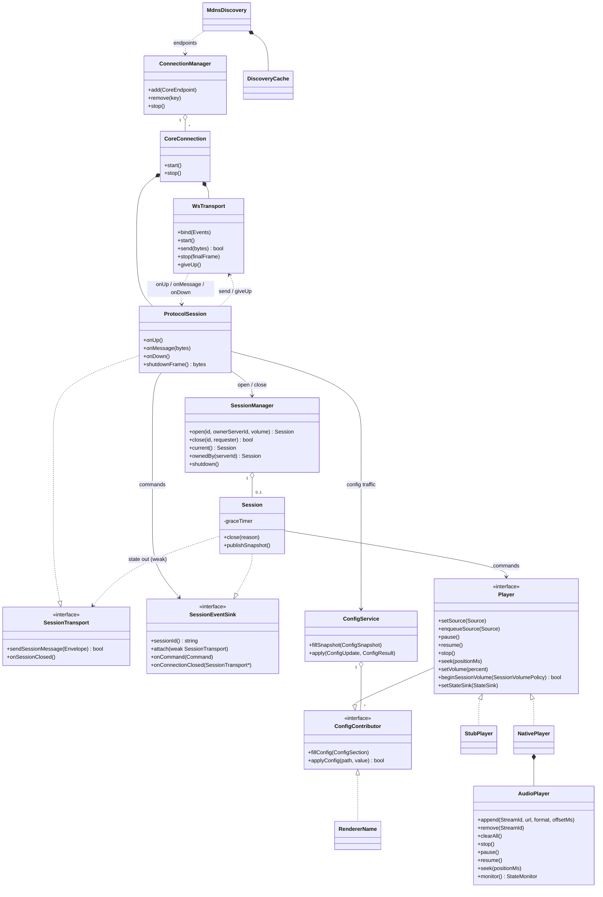

# Standalone native renderer — design

Status: **implemented**. This describes the renderer as built, and the contract
any other implementation must meet to be one. The schema of record is
[`packages/kalinka-renderer/proto/kalinka/renderer/v1/renderer.proto`](../packages/kalinka-renderer/proto/kalinka/renderer/v1/renderer.proto);
where prose and proto disagree, the proto wins.

Audio output is **ALSA only** — see §6. The protocol assumes no particular
backend: a device is an opaque string a renderer offers and opens.

---

## 1. Shape

Kalinka Core (Python) keeps the library, the play queue and the UI. It holds no
audio: playback is a renderer's job, and a renderer is a separate process,
usually on a separate machine.

```
  ┌──────────────┐   mDNS: _kalinkaplayer._tcp    ┌──────────────────┐
  │   Renderer   │ ─────────── browse ──────────► │  Kalinka Core    │
  │  (this pkg)  │                                │                  │
  │              │ ◄── ws://core/renderer/ws ────►│  play queue, UI  │
  └──────┬───────┘   binary protobuf Envelopes    └──────────────────┘
         │                                                 │
         │ HTTP GET (audio)                                │ serves media
         └─────────────────────────────────────────────────┘
```

Three consequences shape everything below:

- **The renderer connects out.** It browses for Cores and dials them; a Core
  never dials a renderer, so a renderer behind NAT or on a dynamic address
  still works.
- **A renderer serves many Cores but plays for one.** Every connected Core can
  read and write settings; exactly one at a time holds a *playback session*.
- **Media does not flow through Core.** A source is a URL the renderer fetches
  itself.

## 2. Architecture

### 2.1 Objects



`RendererServices` bundles the two shared planes — `SessionManager` and
`ConfigService` — so every connection reaches them without `main()` re-threading
constructors.

### 2.2 The two planes

**Session plane.** Who owns the audio graph, and playback itself. One session at
a time, opened and closed by a Core.

**Config plane.** What the renderer is set up as. Request/response, no session
required: a Core shows a renderer's settings page without claiming its audio,
and several Cores may edit it. Last write wins, nobody is notified, and writes
name individual paths — so a stale page cannot clobber a field it did not touch.
The renderer owns the values, because Core-side storage would mean whichever
Core connected last decides, and a renderer with no Core would have no settings
at all.

### 2.3 Layering

Each layer knows only the one below:

| Layer | Knows | Does not know |
|---|---|---|
| `WsTransport` | sockets, framing, backoff | what a message means |
| `ProtocolSession` | messages, handshake, gating | sockets |
| `Session` | the player, its routes to the owner | protobuf framing |
| `NativePlayer` | the audio graph, token vocabulary | connections |

That seam is what makes the planes testable: `ProtocolSession` binds to a
`Wire` (a `std::vector` in tests), and `Session` holds a `Player` (`StubPlayer`
in tests).

### 2.4 Threading and ownership

One `io_context`, single-threaded. Everything protocol-facing — transports,
protocol sessions, sessions, config, `Player` calls — runs on that thread, so
none of it locks.

Two thread boundaries cross into it:

- **Discovery** runs its own thread; callbacks `post()` onto the io_context.
- **The audio graph** reports through blocking monitors; `NativePlayer` runs
  pump threads that `post()` state onto the io_context.

Ownership is stated in the types: `shared_ptr` where lifetime is genuinely
shared (`RendererServices`, the player, a session), `weak_ptr` for a session's
routes back to its owner, so a connection that dropped simply stops being one.
Async handlers hold `shared_from_this()`, so a completion cannot outlive its
object, and carry the generation of the stream that queued them, so a
superseded stream's completions do nothing.

## 3. Lifecycle

### 3.1 Discovery

A vendored DNS-SD browser watches `_kalinkaplayer._tcp` on port 5353 (no avahi
or Bonjour daemon). A Core is reported only when its TXT carries a
`renderer_proto` inside the version range this renderer speaks; a Core whose TXT
changes — an upgrade re-announcing, say — flips in or out, so a Core that would
only reject the renderer is never dialled.

`DiscoveryCache` decides what is still out there. Every answer restarts an
entry's lifetime — clamped to 240s–600s regardless of the announced TTL, and
refreshed at 80% — so a Core that dies without a goodbye lapses instead of being
retried forever, while a single lost multicast packet can never drop a live
Core. A goodbye is the fast path; the lifetime is what catches everything else.

`--server host:port` replaces all of this with fixed endpoints.

### 3.2 Connection

One `CoreConnection` per Core, keyed by service instance. `WsTransport`
connects, handshakes, and read-loops, reconnecting with doubling backoff (1s to
30s). Inbound messages cross a bounded inbox drained off the read path, so
processing never stalls reads; outbound ones queue behind the one write Beast
allows in flight. Overflow drops the connection rather than growing memory — a
peer that stopped reading gets a reconnect.

On every link-up the renderer sends `Hello`; the Core answers `Welcome`. A
version mismatch or a replaced `renderer_id` is a `Goodbye` and a *give up* —
retrying would only repeat itself.

### 3.3 Playback sessions

A session is a Core's exclusive claim on the audio graph. The Core mints the id;
both sides hold it in memory only, so a crash on either side ends it, and what
survives is reconciled at the next `Hello`.

```
Core                          Renderer
 │  SessionOpen(id, fixed?)      │
 ├──────────────────────────────►│  SessionManager::open()
 │                               │   busy?  → SessionOpenResult(BUSY, owner)
 │◄──────────────────────────────┤   ok     → SessionOpenResult(accepted)
 │◄──────────────────────────────┤  StateSnapshot (on attach)
 │  Command(session_id, …)       │
 ├──────────────────────────────►│  gate → Session → Player
 │◄──────────────────────────────┤  PlaybackStateChanged / SourceChanged / …
 │  SessionClose(id)             │
 ├──────────────────────────────►│
 │◄──────────────────────────────┤  SessionClosed(ACK)
```

Rules the implementation pins down:

- **Idempotent for the owner.** The same id from the same Core returns the
  running session — a retried open is harmless. The same id from anyone else is
  a replay of what `Hello` broadcasts to every Core, and must not hand the graph
  over.
- **The session outlives a connection.** A dropped link leaves playback running;
  the owner reattaches by connecting again, and `SessionManager::ownedBy()` is
  how a freshly-welcomed connection finds the session it should pick back up.
  Attaching answers with a full `StateSnapshot`, so a Core never starts blind.
- **But not indefinitely.** An owner that is gone has `--session-grace` (60s) to
  come back; then the session closes and the player stops. A Core that was
  reinstalled — new `server_id` — cannot leave a renderer claimed forever.
- **Closing stops playback**, however the session ended. Shutdown closes
  immediately: the grace is for owners, not for a process that is exiting.
- **One narrow volume policy rides on `SessionOpen`** and is never written to
  config. `force_fixed_output` says that Core has routed volume to a downstream
  device, so the renderer temporarily runs at unity and exposes no volume
  control. The renderer restores its configured mode and previous local level
  when the session ends. Core never copies or overrides the renderer's own
  `output.volume_mode`.

### 3.4 Configuration

`ConfigService` assembles one section per registered `ConfigContributor` —
today `RendererName`, `NativePlayer` (output) and its buffer settings — and
serves schema and values together, so one round trip is a whole settings page
and enumerated options (the device list) are as fresh as the request.

Writes are validated against the declared field before the contributor sees
them: unknown path, read-only field, unparsable value, out-of-range integer or
an enum value that is not on offer are all refused with nothing attempted. A
range is enforced, not clamped. Values are re-read afterwards, so a
`ConfigResult` reports what is in effect rather than what was asked for, along
with the worst `ApplyCost` among the settings that actually applied.

The schema grows by registration: a new contributor is a new section, not an
edit to the config plane.

### 3.5 Shutdown

SIGINT/SIGTERM: stop discovery (joining its thread), close the session so
playback stops now, then `Goodbye` + WebSocket close on every connection, each
bounded by a 2s deadline. `io_context::run()` returns when the last one is gone.

## 4. The renderer contract

What a program must do to be a Kalinka renderer. Nothing here is C++-specific;
the reference implementation is one way to satisfy it.

### 4.1 Transport

- Connect to `ws://<core-host>:<port>/renderer/ws`.
- Every WebSocket message is **binary** and carries exactly one `Envelope`.
- `Envelope.message_id` is monotonic from 1, per connection and per direction,
  and resets on reconnect.
- `Envelope.in_reply_to` is set only on config replies — the sole
  request/response traffic.
- Reconnect on loss, with backoff. Do not reconnect after a `Goodbye` whose
  reason is `VERSION_UNSUPPORTED` or `REPLACED`.

### 4.2 Discovery

Optional — an implementation may be pointed at a Core by configuration. To
discover: browse `_kalinkaplayer._tcp.local.` and read the `renderer_proto` TXT
value, which is the protocol version that Core speaks. A Core without the key
does not have the endpoint at all. Connect only when that version is one you
speak — the reference renderer matches it against the range it offers in
`Hello`, so a Core that moves ahead of it stops being dialled rather than being
dialled and rejected.

With `server.interface=all`, a multi-homed Core announces one DNS-SD instance
for every IPv4 address. For a specifically selected interface, Uvicorn's exact
resolved bind address is passed to discovery and only that address is
announced. Each instance contains only its own A record, so an answer received
on one network never offers an unrelated address from another network. The
instances have different transport-level names but carry the same stable
`server_id` TXT value and the same user-facing `display_name` TXT value. A
discovery client must therefore:

- key the logical Core by `server_id`, falling back to the instance name only
  for older Cores which do not advertise an id;
- show `display_name`, not the suffixed instance name;
- retain the resolved endpoint of every instance as a candidate, without
  merging their A records;
- replace the active route when its instance disappears, while treating the
  Core as removed only when its last instance disappears; and
- treat a record of the same host:port held under a different identity as
  superseded by the newly resolved instance. Two Cores cannot share one
  listener, so that record is the same Core's earlier announcement, orphaned
  by an unclean restart across an identity change (an upgrade to
  `server_id`-aware announcements, a wiped state directory). Kept alive, its
  reconnect loop and the new one would register the same `renderer_id` twice
  and the Core would displace one of them. Only the matching endpoint is
  superseded, never its whole group: after a DHCP reassignment the address may
  genuinely belong to a different Core whose other addresses are still live.

Route replacement is not renderer shutdown. It must close the superseded link
without a `Goodbye(REASON_SHUTDOWN)`, allowing an active playback session to be
reconciled on the replacement link. Clients which do not implement this
grouping will show or open one Core per server address and must be upgraded
before relying on multi-interface discovery.

### 4.3 Handshake

1. On every link-up, send `Hello` **first**, before anything else. A second
   `Hello` on one connection is a protocol error and the Core will close.
2. `Hello` must carry `protocol_versions`, `renderer_id`, `instance_id`,
   `friendly_name`, `software_version` and `kind`. `platform` is informational.
   - `protocol_versions` is the range you speak, and the Core picks a version
     inside it. Advertise every version you still handle, not only the newest:
     the reference renderer sends the `kMin`/`kMax` pair from
     `src/Protocol.h` — both 1 today.
   - `renderer_id` is **stable across restarts and upgrades** — it is how a
     Core tells one renderer from another. Persist it; mint one on first run.
   - `instance_id` is **fresh per process** — it is how a Core knows the
     renderer restarted rather than merely reconnected.
   - Registering a `renderer_id` that another live connection already holds
     retires that older connection with `Goodbye(REPLACED)`.
3. If a session is running, `Hello` also carries `active_session_id` and
   `session_owner_server_id`. This is broadcast to *every* Core; only the owner
   acts on it. This is the reconnect half of session survival.
4. The Core answers `Welcome` with the negotiated `protocol_version` and its
   `server_id`. Keep the `server_id`: it identifies the Core for session
   ownership. A Core that cannot speak your range sends
   `Goodbye(VERSION_UNSUPPORTED)` instead and closes.
5. Nothing else may be sent before `Welcome` arrives.

### 4.4 Sessions

- On `SessionOpen`, answer `SessionOpenResult` with the same `session_id` and
  either `accepted = true`, or `accepted = false` with `ERROR_BUSY` and
  `owner_server_id` set to the Core that holds the session, or `ERROR_INTERNAL`
  with a `detail`.
- Accept exactly one session at a time. A repeat of the *running* id from its
  *owner* is accepted again (same session). The same id from another Core is
  refused as busy.
- Apply `SessionOpen`'s volume policy before running any command of that
  session. It has one field, `force_fixed_output`:
  - `false` leaves `output.volume_mode` authoritative. In `auto`, `hardware`,
    or `software` mode, lower the current level to the renderer's configured
    `output.session_start_volume_ceiling_percent` if it is above that ceiling.
    Never raise an already quieter level. Refuse the session if the ceiling
    cannot be enforced.
  - A persistently configured `fixed` mode means the listener controls volume
    outside Kalinka, for example with an amplifier's physical knob. Set the
    selected ALSA playback mixer to 100% when one exists, keep software gain at
    unity, report volume as unsupported, ignore `SetVolume`, and bypass the
    session-start ceiling.
  - `true` applies that same fixed-unity state temporarily when Core has mapped
    the renderer to a downstream device module. This is a mode override, not a
    volume value: there is no session `volume_percent`. Restore the renderer's
    configured mode and its previous local level when the session ends, and
    never persist the override.
- Treat the session-start ceiling as a startup guardrail, not a limiter. It
  reduces the chance that a locally controlled output left loud surprises the
  listener, but deliberately cannot protect a fixed output: choosing fixed
  transfers responsibility for a safe listening level to the downstream amp.
- After accepting, send a `StateSnapshot` unprompted. Send one again whenever a
  connection (re)attaches to a running session, and on `RequestSnapshot`.
- On `SessionClose`, end the session, stop playback, and answer
  `SessionClosed(REASON_ACK)`. Ending a session on your own initiative is
  `SessionClosed(REASON_RENDERER_ERROR)` with a `detail`.
- A session must not outlive its owner indefinitely: pick a grace period, close
  when it expires, and stop playback when it does.
- Playback must not outlive the process: close on shutdown, before the
  connections go.

### 4.5 Commands

- Every `Command` carries `Envelope.session_id`. **Gate on it**: a command that
  names anything other than the session you are running — never opened, already
  closed, or another Core's — is answered once with `CommandRejected`
  (`session_id`, the `ControlKind`, `at_unix_ms`, a `detail`) and **nothing is
  attempted**.
- A command that passes the gate is *not* acknowledged. What it did shows up in
  the state that follows — including failure, as `PLAYBACK_STATE_ERROR`.
- Run commands in arrival order, one at a time.
- The set: `SetSource`, `EnqueueSource`, `RemoveSource`, `ClearQueue`, `Pause`,
  `Resume`, `Stop`, `SetVolume`, `Seek`, `RequestSnapshot`.
  - `SetSource` replaces the queue and **starts playing on arrival** — there is
    no separate start command.
  - `EnqueueSource` queues behind the current source for a gapless switch and
    must not disturb what is playing.
  - `Resume` is the inverse of `Pause` and nothing more: holding no source,
    there is nothing to resume.
  - `Stop` closes the device; `ClearQueue` drops everything but keeps it open.
  - `Source.start_offset_ms` begins the stream partway in without a seek behind
    it. Positions you report stay **absolute in the stream**.
  - `Source.source_token` is Core-assigned and opaque. Echo it back on every
    state message about that source; never infer which source a state belongs
    to from ordering.

### 4.6 State

Report, with `Envelope.session_id` set:

| Message | When |
|---|---|
| `StateSnapshot` | on attach, and on `RequestSnapshot` |
| `PlaybackStateChanged` | every playback-state transition, carrying the format the state is about |
| `SourceChanged` | the gapless crossover to the next source |
| `VolumeChanged` | the level changed, `external = true` when something other than a command did it |
| `PlaybackError` | a failure with no state transition to carry it. Core accepts it; the reference renderer never sends one, because every failure it has reaches a state — `PLAYBACK_STATE_ERROR` with `error` set |

- Positions are advanced to send time and paired with `at_unix_ms` /
  `captured_at_unix_ms` wall-clock stamps. A renderer-local monotonic clock
  value must not go on the wire.
- `PlaybackStateChanged.source_token` absent means the graph holds no current
  source — that is how "the track ended" differs from "playback was torn down".
- `PlaybackStateChanged.format` is restated every time, so a Core replaces it
  rather than merging: absent means nothing is decoded — a source not yet read,
  a stopped or failed graph — never that the format is unchanged. A source
  change clears it.
- `device_info` is the output side — what the device was opened at, and
  whether it is held exclusively — against which `format` is what came out of
  the decoder. Either may be absent on its own: a browser renderer knows what
  its own output runs at and never what it decoded.
- `device_info.access` is `EXCLUSIVE` only when the renderer holds the device
  itself; `SHARED` is not proof that anything alters the samples, only that
  nothing rules it out. It settles no bit-perfect question alone — software
  attenuation rewrites samples on an exclusive device too, and `VolumeState`
  is where a Core reads that.
- `duration_ms` belongs to the stream rather than to either format, so a
  renderer that cannot name a format can still say how long the source runs.
- State is fire-and-forget: if no route to the owner exists, drop it. A fresh
  snapshot goes out when the owner reattaches, so stale state has no value.

### 4.7 Config

- Answer `ConfigRequest` with `ConfigSnapshot`, `in_reply_to` set to the
  request's `message_id`. **No session is required** — a Core reads and writes
  settings without claiming the audio graph, and any connected Core may.
- Declare each field with `path` (dotted, renderer-local, unique across the
  renderer), `type`, `value`, `default_value`, `apply` cost, `read_only`,
  `importance`, and — for enums — `options`, whose `value` is whatever you open
  and `label` is what the user picks. Enumerate options at request time so a
  device list is as fresh as the request.
- `config_version` covers the *shape* and the options, never the values. It is
  not a write precondition.
- Answer `ConfigUpdate` with `ConfigResult`, again `in_reply_to`: one `Outcome`
  per requested path, `value` re-read after applying, `error` set when refused,
  and `effect` = the worst `ApplyCost` among the settings that actually applied.
- Refuse — do not clamp, do not partially apply a single setting — an unknown
  path, a read-only field, a value that does not parse as the field's type, an
  integer outside its declared range, or an enum value not among the options.
- Config paths and values are renderer-owned. Core renders and validates the
  schema, then passes selected values back verbatim; in particular, it does not
  interpret `output.volume_mode` when opening a session.

### 4.8 Goodbye

Send `Goodbye(REASON_SHUTDOWN)` before closing cleanly. Expect
`Goodbye(VERSION_UNSUPPORTED | MALFORMED | REPLACED | REJECTED)` from a Core,
and treat the first and the last as terminal for that endpoint.

### 4.9 Not required

Multi-room synchronisation, authentication or pairing, an application-level
ping/pong (the protocol has none — a dead link is discovered by the WebSocket
closing), and any particular audio backend, container or codec beyond what you
advertise by succeeding or failing to play a source.

## 5. Audio graph

`NativePlayer` is the seam between the protocol and the graph. It wraps
`AudioPlayer` — the same graph that used to live in the server — and adds the
two things that graph deliberately lacks:

- **Token vocabulary.** The graph names streams by `StreamId`; the protocol
  names them by the Core's opaque `source_token`. The mapping is bookkeeping in
  `NativePlayer`; a state is stamped with the token it belongs to, never
  inferred from ordering.
- **A thread boundary.** Graph state arrives on blocking monitors; pump threads
  post it onto the io_context.

`StateTranslator` is where the "do not change existing semantics" contract is
pinned: every `AudioGraphNodeState`, `StreamErrorSource` and `VolumeBackend`
maps to exactly one protocol value, as pure functions with no other inputs.

The graph itself: HTTP or file input → FLAC/MP3 decoder → buffer →
`AudioStreamSwitcher` (gapless) → `AlsaAudioEmitter`, with `AlsaVolumeControl`
alongside for hardware or software level, and `StateMonitor` reporting.

If the graph cannot be built — no ALSA at all — the renderer stays up.
Commands that need audio answer `PLAYBACK_STATE_ERROR`, exactly like a track
that failed, and the next device change retries.

## 6. Output backends

ALSA is the only one implemented, and `output.driver` offers only `alsa`. In
practice that reaches any Linux sink ALSA can address: a card's `hw:` device,
`default`, a `dmix`/`plug` PCM, or the ALSA compatibility layer of PulseAudio or
PipeWire. Devices are enumerated at request time, output-capable PCMs only, and
a configured device that is not currently present stays selectable — a page must
be able to show what is set even while the card is unplugged.

Adding a backend means another `Player` implementation (or another sink under
`NativePlayer`) contributing its own config section. Nothing in the protocol,
the session plane or the config plane needs to change: a device is an opaque
string the renderer offers and opens.

## 7. Persistence

Under `<KALINKA_PREFIX>/var/lib/kalinka-renderer` (`KALINKA_PREFIX` defaults to
`/`, matching the server's `paths.py`):

- `renderer_id` — the stable identity. Not writable ⇒ an ephemeral id for the
  run, logged as a warning, and every Core sees a new renderer at each restart.
- `config_overrides` — `key=value` lines, only settings that differ from the
  compiled-in defaults, so a default that changes in a later release reaches
  installs that never touched it. Each contributor saves its own keys without
  disturbing anyone else's.

## 8. Testing

`kalinka-renderer-tests` (GoogleTest, `ctest`) covers each seam on its own:
transport (reconnect, generation fencing, queue bounds), protocol session
(handshake, gating, config routing), session and manager (ownership, grace,
reattach, shutdown ordering), config service (validation, apply costs),
state translation, ALSA device naming, and the audio graph — switching,
concurrency, decoder start offsets, volume-monitor lifetime.

Playback tests run against the ALSA `null` device, which consumes frames as
fast as they are written; the cases whose subject is real-time playback skip
unless `KALINKA_TEST_ALSA_DEVICE` points at a device that plays in real time.

Protobuf compatibility is structural: the C++ side generates from
`renderer.proto` at build time, and the Python bindings the server uses are
committed and regenerated from the same file with `make proto`.

## 9. Deliberate exclusions

- **Multi-room sync.** Out of scope; the protocol says nothing about it.
- **Authentication and pairing.** The renderer trusts the network it is on.
- **Core-side settings storage.** The renderer owns its values (§2.2).
- **Command acknowledgements.** State is the acknowledgement (§4.5).
- **An ownership lease.** Superseded by playback sessions; the field numbers
  stay reserved in the proto.
