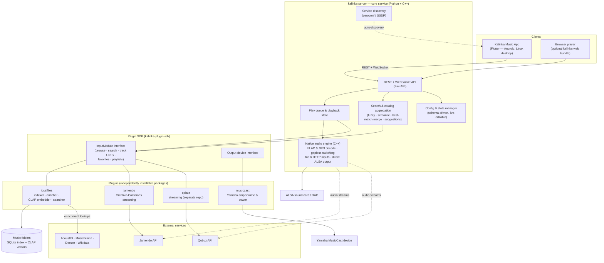

# What is Kalinka?

Full disclosure up front: I build Kalinka. This is the write-up I wish I could link when someone asks "so what is it, and why not just use X?" — what the system actually is, how it's put together, and an honest map of where it beats the alternatives and where it clearly doesn't. Facts about the other products were checked in July 2026; if I've gotten something wrong about your favorite player, corrections are welcome.

> Based on Kalinka v3.4, July 2026. Website: [kalinkaplayer.com](https://kalinkaplayer.com)

## The short version

Kalinka is an open-source music system for people who run their own audio hardware. You point it at a folder of music on a small Linux box — a Raspberry Pi 4 with a DAC hat is the reference setup — and it turns that folder into a properly organized, searchable library you control from a phone. There's no account, no cloud dependency and no subscription anywhere in the stack.

It's two cooperating pieces of software:

- **KalinkaPlayer** — a lightweight backend service for Linux (arm64/amd64). It owns the music library, the play queue and the audio output, and exposes a REST + WebSocket API. The performance-critical audio engine is written in C++ and talks to ALSA directly.
- **Kalinka Music App** — a Flutter client for Android, Linux desktop and Web that discovers the server on your network automatically and acts as the remote control: browsing, search, queue, favorites, playlists and live server settings. An optional browser-based player can be installed on the server as well.

Everything beyond the core ships as **plugins**: the local-files library (the most developed part by far), streaming sources ([Jamendo](https://www.jamendo.com)'s Creative-Commons catalog, and an experimental [Qobuz](https://www.qobuz.com) integration for subscribers), and device integrations such as Yamaha MusicCast volume/power control.

The intended user is specific: DIY HiFi people who are comfortable with Linux and the command line, and who want a controllable, efficient audio backend rather than a sealed appliance. The server runs headless on hardware as small as a Raspberry Pi 3 or Zero 2 W (512 MB RAM) for playback and library duties; enabling AI search raises the bar to a Pi 4B with 4 GB. Only 64-bit OSes are supported. The server is licensed GPL-3.0-or-later; the app's source is Apache 2.0.

## The interesting parts

### The library fixes its own metadata

Most self-hosted music servers read whatever tags your files happen to have and stop there. Kalinka starts from the opposite assumption: real-world collections are messy — inconsistent tags, cryptic folder names, missing artwork — and cleaning that up is the system's job, not yours.

The indexer watches your music directories (with an upload-quiescence window, so half-copied files aren't picked up) and feeds an enrichment pipeline that first reads embedded tags and local file metadata such as filename, path, and technical parameters. If an AcoustID API key is configured, it computes a fingerprint to identify the recording. The resulting metadata is then filled out through **MusicBrainz**, **Wikidata**, and **Deezer**; when external sources still can't resolve a track, filesystem heuristics keep the library browsable. Artwork is extracted and cached, and artist/album/track relationships are modeled properly in a local SQLite database. Nothing is written back to your files — the originals are never touched.

### Search by describing the music

The genuinely unusual feature. **AI search** is an optional, fully local semantic search layer: a background embedder runs a CLAP audio–text model (ONNX, downloaded on first boot) over your tracks, so a query like *"dreamy ambient guitar"* or *"upbeat synth pop"* returns results ranked by what the music actually sounds like, blended with full-text and metadata signals.

The part I care about is *where* it runs: on your own hardware, over your own files, with no cloud API, no API key and no per-query cost. That combination is rare — elsewhere the feature is either absent, welded to a cloud LLM behind a subscription (Volumio's Supersearch, Plexamp's Sonic Sage), or a separate add-on service that wants x86-class hardware (AudioMuse-AI). The trade-off is real, though: the model holds ~285 MB of resident RAM and the initial embedding pass is CPU-heavy, so the feature is opt-in — you can start on a 512 MB board and flip it on later after moving to something bigger.

### The audio path

Playback is a C++ audio graph with direct ALSA access — no PulseAudio or PipeWire in the middle — giving a bit-perfect path where your ALSA configuration permits. It plays FLAC (up to 192 kHz / 24-bit) and MP3, from local files or HTTP streams, with gapless transitions between consecutive tracks of the same format. The server idles comfortably on a Raspberry Pi; the machine's resources go to your library, not to the runtime.

### One queue, many sources

Sources are equal citizens in the play queue: local tracks, Jamendo streams and Qobuz titles can be queued back-to-back. Search fans out across sources and merges results with best-match ranking, so "play that song" doesn't require remembering which backend it lives in.

### Everything else is a plugin

The server core is small; sources and devices arrive through a plugin SDK with typed interfaces for input modules (browse / search / track resolution / favorites / playlists) and output devices. Plugins are ordinary Python packages discovered at runtime, each shipping as its own Debian package — and a cookiecutter template gets a new one compiling in minutes. Configuration is schema-driven and editable live from the app, with a curated "simple" tier plus an `about:config`-style search over everything else, and maintenance actions (rebuild library, restart server) are one tap away.

## Architecture

Kalinka is a hub-and-spokes design. The **core server** owns the API, play queue, playback state, configuration and the native audio engine. **Plugins** — connected through the SDK's typed interfaces — provide everything source- or device-specific. **Clients** are thin: the Flutter app and optional web player drive the server over REST, with WebSocket channels pushing live queue/device state back.

Deployment matches the DIY audience: everything builds into separate Debian packages (one for the server, one per plugin) for arm64 and amd64. A systemd unit bootstraps a private virtualenv at startup and picks up any plugin wheels it finds, so installing a plugin is `dpkg -i` plus an automatic restart. For development, a fakeroot mode runs the whole stack from a source checkout with no root and no systemd.

## How it compares

Obvious caveat for this section: I wrote the product being compared, so weigh accordingly — I've tried to keep the table to checkable facts. Details were verified in July 2026, and pricing in this space has moved a lot this year, so re-check before deciding.

The self-hosted music space is crowded, but the products cluster into a few families, and each family solves a different problem well. Kalinka sits in an intersection that is currently empty: Volumio's hardware niche crossed with Roon's intelligence niche — a free, open-source, Pi-class headless player whose library brains (automatic enrichment, fully local natural-language search) the DIY options lack and the commercial options deliver from the cloud, for a subscription. What follows is where each family is stronger, and where Kalinka is.

| Product | License / cost | Server on a Pi? | Metadata enrichment | AI / semantic search | Streaming services | Multi-room |
|---|---|---|---|---|---|---|
| **Kalinka** | GPL‑3 · free | Yes — Pi 3 / Zero 2 W; AI search: Pi 4, 4 GB | Automatic waterfall: AcoustID fingerprint → MusicBrainz → Deezer → Wikidata, filename fallback | **Local CLAP embeddings** — natural-language, offline, free | Jamendo (CC); Qobuz (experimental) | No — single zone |
| Volumio | Open-core · free tier; Premium $8.49/mo or $79.99/yr | Yes (Pi-first) | Minimal (extra credits in Premium) | "Supersearch" — ChatGPT in the cloud, Premium-only | Tidal, Qobuz, HighResAudio — Premium | Premium (up to 6 zones) |
| moOde | GPL‑3 · free | Yes (Pi-only) | None — tags as-is | None | None (Spotify Connect / AirPlay renderer only) | DIY |
| Roon | Proprietary · $14.99/mo ($12.49 annual) or $829.99 lifetime | No — x86/NAS server; Pi as endpoint only | Best-in-class (cloud editorial + credits) | Valence cloud recommendations; no natural-language library search | Tidal, Qobuz, KKBOX | Yes (RAAT) |
| Plexamp | Proprietary · free tier; Plex Pass $6.99/mo, $749.99 lifetime | Headless Pi client (Pass); server heavy for a Pi | Automatic (Plex music agent) | Sonic Analysis (local similarity) + Sonic Sage (cloud LLM) — Pass-gated | Tidal (paid add-on) | Casting only |
| Navidrome | GPL‑3 · free | Yes | Deliberately minimal — respects your tags | None native (AudioMuse-AI add-on) | None | No |
| Jellyfin + Finamp | GPL‑2 · free | Yes | Plugin-based (MusicBrainz/TheAudioDB), hit-or-miss | None native (AudioMuse-AI plugin) | None | No |
| Lyrion (ex‑LMS) | GPL‑2 · free | Yes | Basic, plugin-based | None native (AudioMuse-AI integration) | Qobuz, Tidal, Spotify via plugins | Yes — classic strength |
| MPD / Mopidy | GPL‑2 / Apache‑2 · free | Yes | None | None | Mopidy extensions (fragile) | DIY (Snapcast) |

### Raspberry Pi audio distros: Volumio and moOde

Volumio and moOde are Kalinka's closest neighbors: audiophile playback systems that turn a Pi into a network player. Both are more mature, support more formats and renderer scenarios (AirPlay, Spotify Connect, Bluetooth), and moOde in particular offers deep DSP options (CamillaDSP, parametric EQ). The differences are philosophical. Volumio has gone freemium: streaming logins, multi-room, even Bluetooth input and its ChatGPT-based "Supersearch" AI all live behind a subscription with a cloud account attached. moOde is free, GPL and cloud-free like Kalinka, but is a classic MPD-based design: it plays exactly what your tags say you have. Neither attempts metadata enrichment, and neither understands your library semantically — Volumio's AI search is cloud discovery via ChatGPT, not local analysis of your own files. Kalinka trades their format breadth and DSP depth for library intelligence: fingerprint-based identification, multi-source enrichment, and description-based search that runs on the same board.

### Premium ecosystems: Roon, Plexamp, Audirvana

Roon is the reference point for "music server with brains": superb editorial metadata, multi-room via RAAT, ML-driven recommendations (Valence — though search itself stays conventional). It is also closed-source, subscription-priced under Harman ownership, and its server won't run on a Pi at all — a Pi can only be an endpoint. Plexamp is the closest in spirit on the intelligence axis: Sonic Analysis runs ML over your files for similarity mixes, and Sonic Sage generates playlists from prompts via a cloud LLM. It gained a free tier in 2023, but the intelligence — and the headless Raspberry Pi player — sits behind a Plex Pass (whose lifetime price tripled to $749.99 in July 2026), on top of a closed, cloud-account-mandatory media server. Audirvana targets desktop audiophile playback on Mac and Windows rather than a headless library appliance. The trade against all three is straightforward: they offer polish, support, deeper streaming catalogs and (in Roon's case) real multi-room, none of which Kalinka matches; Kalinka implements the same core ideas — enrichment, audio-embedding search, bit-perfect playback — as open code on your own hardware, with no subscription and no cloud in the loop.

### Self-hosted servers: Navidrome, Jellyfin, Lyrion

Navidrome, Jellyfin (with Finamp) and Lyrion Music Server are excellent free servers, but they solve a different problem: serving your files to many clients, often over the internet, with multi-user support. Playback happens in the client; the server is a catalog and a transcoder. Kalinka inverts that: the server *is* the player, wired to a DAC, and the clients are remotes — the model HiFi streamers use. Navidrome and Jellyfin also index by what your tags say (Navidrome deliberately so; Jellyfin's enrichment plugins are hit-or-miss with curated libraries), and none of the three searches semantically out of the box — in that ecosystem those features arrive via AudioMuse-AI, the add-on covered below. Lyrion remains unbeatable for whole-house Squeezebox multi-room, which Kalinka doesn't attempt today.

### Building blocks: MPD and Mopidy

MPD (and Mopidy, its Python-extensible cousin) are daemons you assemble a system around: bring your own client, your own library discipline, your own glue. Kalinka occupies the layer above — closer to what you'd assemble *from* such parts, but delivered as an integrated product with a first-party app, an enrichment pipeline and an upgrade path, while remaining open and pluggable underneath.

### The new wave: AudioMuse-AI and Music Assistant

Two newer open-source projects work the same territory from different angles. **AudioMuse-AI** (AGPL) brings local sonic analysis, similarity queues and natural-language playlists to Navidrome, Jellyfin, Lyrion, Emby and Plex — the same local-music-AI idea Kalinka builds in, arrived at independently. The architectural difference: AudioMuse-AI is a separate analysis service bolted onto an existing server, happiest with a 4-core AVX2 CPU and 8 GB of RAM, while Kalinka builds embedding search into the player itself and runs it on the same Pi 4 that feeds your DAC — with fingerprint-based enrichment underneath, which AudioMuse-AI's host servers don't do. **Music Assistant** (Apache-2.0) solves the opposite problem: aggregating a dozen streaming providers into whole-home multi-room via its open Sendspin protocol, with LLM voice/chat control through Home Assistant. It's a hub for orchestrating many sources and rooms; Kalinka is a single high-quality endpoint that owns and understands its library.

## What Kalinka doesn't do (yet)

Kalinka is young — the README itself calls it experimental. The current edges:

- **Formats**: FLAC and MP3 only today. Collections heavy in ALAC, Opus, WAV or DSD need conversion or another player.
- **Multi-room**: one server drives one output. There is no synchronized whole-house playback.
- **Streaming breadth**: Jamendo plus an experimental Qobuz plugin. No Tidal or Spotify; subscribers deep in those ecosystems are better served elsewhere.
- **DSP**: no EQ or room-correction chain — the design goal is a clean bit-perfect path, not signal processing.
- **Polish over breadth**: development effort concentrates on the local-library experience; other areas move slower.

And by design, it asks for a DIY temperament: you install a Debian package on a Linux box and own the result. If you want a sealed appliance with support, that's what the commercial products are for.

## Which one should you actually run?

Problem-first:

- **Whole-house synchronized audio** → Lyrion, Music Assistant, or Roon. Kalinka is single-zone.
- **Maximum format support and DSP on a Pi, with tags you already keep clean** → moOde, or plain MPD.
- **Deep Tidal/Qobuz integration with commercial polish and support** → Roon; Volumio Premium if it must live on a Pi.
- **Serving your files to many users and devices over the internet** → Navidrome or Jellyfin, plus AudioMuse-AI if you want similarity queues and prompt playlists.
- **A large, imperfectly tagged local collection, one good DAC, and the wish to browse and search it like a curated service — without a subscription or a cloud account** → this is the problem Kalinka is built around.

That last combination — automatic enrichment, local semantic search and integrated bit-perfect playback on Raspberry-Pi-class hardware — is, as far as I know, not implemented by any other open-source project right now. If I've missed one, tell me; that's half the reason for writing this up.
